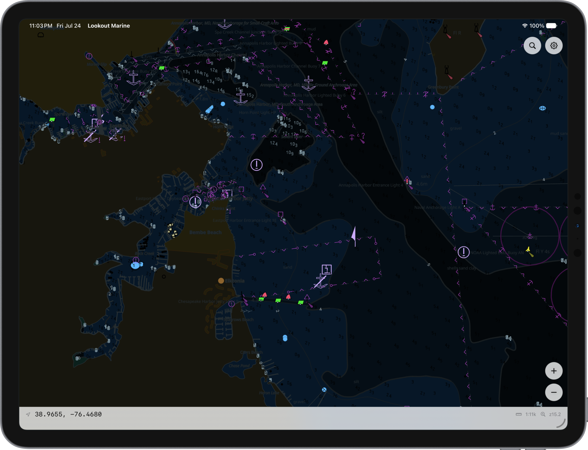

# Lookout Marine

**A fast, native chartplotter for Mac, iPad, iPhone, Android and Linux.** It draws
official ENC charts with the IHO portrayal rules, straight to the GPU with Metal or
Vulkan, and holds **60 fps** while you pan, pinch-zoom, rotate and switch between day
and night.

> **Not for navigation.** This is a prototype. It is not pixel-perfect and it makes
> no claim of ECDIS conformance.

| macOS · iPadOS · iOS | Linux |
|:---:|:---:|
|  |  |
| SwiftUI | GTK4 |

## Why it is different

- **It stays at 60 fps.** The chart is tessellated one time. Each frame after that is
  a single uniform update. Therefore a pan, a zoom, a rotate, or a day-to-night
  change never waits for a rebuild. An idle chart uses no CPU time.
- **The UI is native on every platform.** SwiftUI on Mac, iPad and iPhone. GTK4 on
  Linux. Java on Android. Each app uses its own toolkit directly. None of them is a
  cross-platform toolkit with a theme, and none of them is a web view.
- **The portrayal is official, not an imitation.** The engine runs the IHO **S-101
  Portrayal Catalogue** against the feature records in the cell. The chart is not a
  pre-rendered raster image, and no symbol is a look-alike. You get depth areas and
  contours, buoys and beacons with correct symbols, lights with sector lines,
  soundings, anchorage and restricted areas, and place names.
- **It opens a whole coastline.** Point it at a folder of cells. A 1,700-cell library
  opens in about 15 ms, and the first scene appears in less than a second. The app
  does not freeze while it composes the library.
- **It is vector all the way to the GPU.** The app caches no bitmap of the chart. It
  draws with 4x MSAA at the full resolution of the display.

## Built for S-101

The world is moving from **S-57** to **S-101**, the ENC format in the IHO S-100
framework. The Phase 1 S-100 product specifications came into force in January 2026,
and S-100 ECDIS became legal to use on the same date. Hydrographic offices begin
S-101 production in 2026, and regional coverage grows from there. Every new ECDIS
installation must meet the updated IMO performance standards from 1 January 2029.
Offices must publish S-57 and S-101 together through a "dual fuel" period, and the
IHO expects that period to last approximately a decade. Refer to the
[IHO S-100 implementation strategy](https://iho.int/en/s-100-implementation-strategy).

Lookout is built for the destination, not for the present:

- **S-101 is the native path.** The engine reads a native S-101 dataset directly into
  the portrayal model. It then draws it with the official S-101 Portrayal Catalogue.
- **S-57 is the interim path.** Today almost all public charts are S-57. The engine
  converts an S-57 cell into the S-101 data model first, then draws it with the same
  catalogue. The conversion is best-effort, because S-57 has no perfect translation
  to S-101.
- **Nothing above the conversion changes.** The portrayal, the tessellation, the
  renderer and the apps see S-101 features only. When an office publishes S-101 for
  your area, you use the native path and drop the conversion step. The apps need no
  change.

## What you can do with it

- **Move like a chartplotter.** One-finger pan with fling, pinch-zoom anchored below
  your fingers, two-finger rotate, double-tap to zoom, and tap to identify a feature.
  Mac, iPad and Linux add pointer control and cursor readouts.
- **Switch between day, dusk and night.** The scheme changes immediately, because a
  new palette needs no rebuild.
- **Tune the chart to your eye.** The mariner panel controls the safety contour, the
  shallow and deep contours, the safety depth, two-shade or four-shade water, the
  display categories, the sounding and text switches, symbol size, and date-dependent
  features. Each edit applies live.
- **Go to a position.** Type a coordinate into search, for example
  `38 58.5N 76 28.9W`.

<p align="center">
  
  
</p>

## Loading charts

Lookout opens **chart archives**. You bake them from the ENC cells that hydrographic
offices give away at no cost. For the United States, the full NOAA ENC catalogue is
one download.

- **On Mac:** **File ▸ Open Chart…** takes one chart or a folder.
- **On Linux:** **Open** in the headerbar takes a folder of cells.
- **On iPhone and iPad:** import cells with the Files picker. The app composes
  everything in its Documents folder at launch.

Bake the charts with the command-line tool of the [tile57] engine:

```sh
tile57 bake CELL.000 -o out/      # one cell
tile57 bake ENC_ROOT -o out/      # a full ENC_ROOT -> a chart library
```

## Getting the app

There is no App Store build yet. Build it from source with **Xcode** (macOS 14+ SDK;
the iOS floor is 15.0). You also need **Zig 0.16** (`brew install zig`) and
**XcodeGen** (`brew install xcodegen`).

```sh
cd macos
xcodegen generate          # writes LookoutMarine.xcodeproj from project.yml
open LookoutMarine.xcodeproj
```

Select the **LookoutMarine** (Mac) or **LookoutMarine-iOS** target, then Run. The
pre-build phase runs `zig build`. That step gets the chart engine and installs
everything the app links against, so you pre-build nothing. Use the Release
configuration of Xcode for a non-debug app.

If you have no Xcode, `macos/build-dev.sh --zig` builds the Mac app with the Command
Line Tools into `macos/build/`.

On Linux — refer to [linux/README.md](linux/README.md):

```sh
cd linux && meson setup build && ninja -C build && ./build/lookout-marine
```

---

## Under the hood

Lookout is a thin native app above a shared **chart core in Zig**. The core opens a
chart or a library. It asks the engine for a **GPU scene**: vertices, quads, the paint
order, and a color buffer for each scheme. The core uploads that scene one time. To
draw a frame, the core then writes one uniform block. The vertex shader applies the
camera, the palette, the display-category gates and the SCAMIN limits. This is the
reason that a pan and a scheme change never tessellate the chart again.

The **app shells** are each native above that one core. `macos/` is SwiftUI, and the
Mac and iOS targets share the Swift sources. `android/` is a Java shell above a
`SurfaceView`. `linux/` is GTK4 in C, and it presents Vulkan into a subsurface below a
transparent hole in the window, so the chrome floats above the chart. Each shell
drives the same `lookout.h` C ABI.

The largest tasks are in the **[tile57]** engine: ISO 8211 and S-57 decode, the
S-57-to-S-101 conversion, S-101 portrayal with embedded Lua, tessellation, sprite and
SDF atlases, and tile composition. The build uses the engine as a Zig package
dependency. A sibling `../tile57` checkout wins when it is present. If it is absent,
the build gets the commit that `build.zig.zon` specifies and compiles `libtile57.a`
from source.

For more detail, refer to [the architecture](docs/docs/architecture.md),
[the Linux host](docs/docs/hosts-linux.md), `macos/README.md` and
`android/README.md`.

[tile57]: https://github.com/beetlebugorg/tile57

## How we use AI

Cross-platform UI forces a choice. One toolkit everywhere feels slightly wrong on
every platform: the scrolling, the menu placement, the settings panel. Separate
native front ends drift apart as soon as one gains a feature first.

We take a third option: a native shell for every platform, written with AI and
kept in step with AI. This is the process:

**The core owns what gets drawn.** Everything portable sits in a Zig core behind
one C ABI (`include/lookout.h`): S-57 decode, S-101 portrayal, tessellation,
camera, GPU scene. The core knows nothing about widgets, menus, or gestures. A
shell can only reach the core through that header, so shells cannot couple to
each other.

**The Apple shell is the reference for behavior.** SwiftUI on Mac and iPad came
first and is the most complete. The other shells follow it and say so in their
own source. The GTK accelerators mirror the macOS menu bar with Ctrl for
Command, and the GTK render loop mirrors the macOS display link. When two shells
disagree, macOS is right by default.

**A change starts as prose, not as a diff.** We describe a behavior once, or
point at what the Apple shell does, then write it into each shell in that
platform's idiom: SwiftUI on Apple, GTK4 in C on Linux, Java on Android, WinUI 3
in C++ on Windows.

**We write real platform code, not a themed abstraction.** Each shell uses its
toolkit the way the toolkit's documentation says to: `GtkOverlay` and `GAction`
on Linux, SwiftUI idioms on Apple, `SwapChainPanel` on Windows. A common
abstraction with platform skins would recreate the compromise we want to avoid.

**We use AI to explore several designs and keep the best one.** The chart on
screen under GTK took three designs; the subsurface below a transparent hole in
the window won. Each design is cheap to write, so the hardware picks the winner.

**The hardware decides, not the reasoning.** We run the app, capture it, and
compare. [The screenshot protocol](docs/docs/screenshots.md) fixes the chart,
camera, and window size every host captures, so we compare platforms frame to
frame instead of by impression.

**Verification gets the most effort.** The work is proof that the app draws
correctly: the right GPU on a dual-GPU machine, the right scale on a fractional
display, the chrome where it belongs. That is where the review goes.

## For developers: building and embedding the core

The chart core builds and runs alone. You can embed it in any native app:

```sh
zig build                  # ReleaseFast by default; -Doptimize=Debug to develop
zig build test             # unit tests
```

`zig build` installs `liblookout_marine.a`, `libtile57.a`, `lookout.h` and `tile57.h`
into `zig-out/`. To embed the core, make a native view, give its surface to
`lookout_open_in_window`, then drive it with `lookout_render`, `lookout_pan`,
`lookout_zoom_at` and `lookout_set_mariner`. Refer to `include/lookout.h`. A headless
program needs no window and gets each frame with `lookout_snapshot_rgba`.

`zig-out/bin/lookout-marine-demo` is the parity and smoke-test tool, not the app. It
renders a chart to day, night and zoomed PNG files, then exits.

```sh
./zig-out/bin/lookout-marine-demo chart.pmtiles [--png out.png] [--lon L --lat L --zoom Z]
```

Two variables help while you iterate. `LOOKOUT_OPEN=<chart|dir>` opens something at
startup. `LOOKOUT_VIEW=lon,lat,zoom[,rot]` selects the first camera position. The
screenshots above use both — refer to [the screenshot protocol](docs/docs/screenshots.md).

### Layout

```
build.zig, build.zig.zon   the build and the tile57 dependency pin
include/lookout.h          the C ABI (the shell-to-core contract)
src/camera.zig             web-mercator camera math (MVP, screen<->geo, SCAMIN)
src/root.zig               Lookout: the scene lifecycle and worker-thread rebuilds
src/gpu.zig                the backend switch (metal | vk | sdl)
src/gpu_vk.zig             the Vulkan transport (Linux and Android)
src/gpu_metal.zig          the Metal transport (with src/metal_shim.{h,m})
src/atlas.zig, src/png.zig sprite and SDF atlas load; PNG encode
src/capi.zig, src/main.zig the C ABI wrapper; the headless demo
docs/                      architecture, host notes, the screenshot protocol
macos/                     the SwiftUI app (macOS and iOS/iPadOS), XcodeGen spec
android/                   the Java shell (Vulkan into a SurfaceView)
linux/                     the GTK4 app (Vulkan into a subsurface), meson
vendor/stb                 stb_image (it decodes the atlas PNG files)
```

The shaders are not here. They read the vertex, quad and uniform layouts that the
engine defines, so they stay with those layouts in the `shaders/` directory of tile57.
This build embeds them from the dependency.

The SDL3, `SDL_GPU`, Vulkan and MoltenVK version of this renderer is at the `sdl-gpu`
git tag, with every driver workaround that it needed.

## Contributing

This project is built with AI assistance — refer to [How we use AI](#how-we-use-ai).
Use AI tools freely. The most useful contribution is a clear set of requirements, or a
rough prototype of what you want, rather than a patch.

[docs/](docs/docs/) has the architecture, the host notes, and the screenshot protocol that
compares the hosts.

## License

MIT — refer to `LICENSE`.
