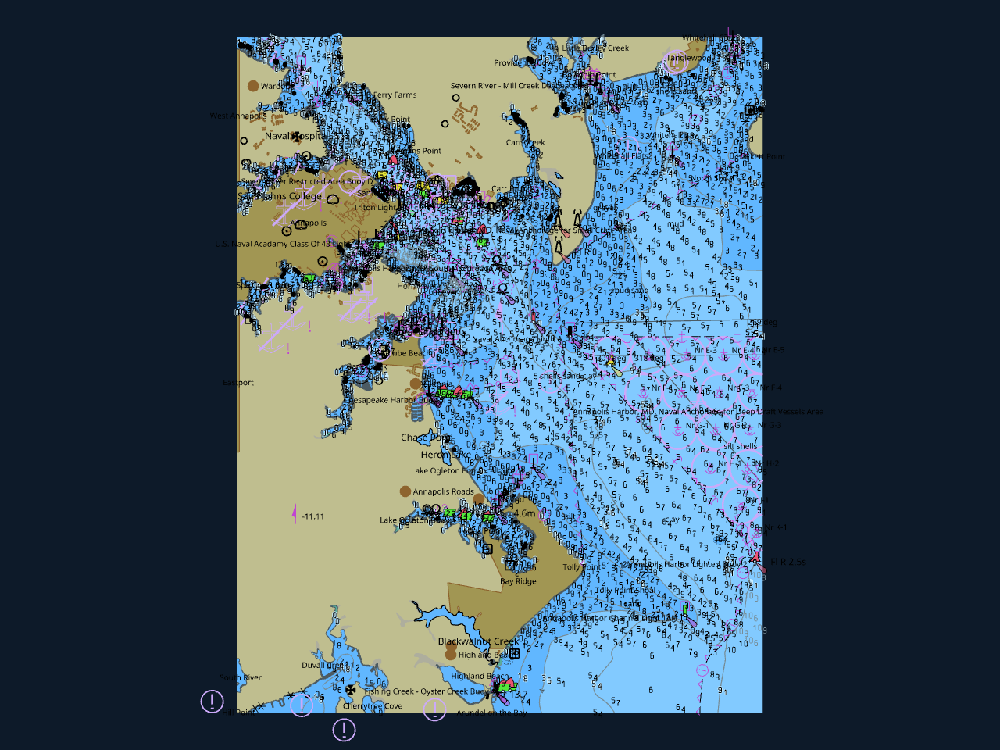

# Lookout Marine

A native **chartplotter for macOS, iOS, and iPadOS**: S-52 electronic
nautical charts (NOAA ENC / S-57), rendered **directly with Metal**, designed
around a hard **60 fps** interaction target — pan, pinch-zoom, rotate, and
day/night switching never re-tessellate or block the frame loop.

> **Not for navigation.** This is a prototype / proof-of-concept. It is not
> S-52 pixel-perfect and makes no claim of ECDIS correctness.



## How it's put together

- **`src/` — the chart core, in Zig.** Opens a baked [tile57] chart (or
  composes a whole library of cells), asks the engine for its **draw-ready GPU
  scene** (vertices, quads, paint order, per-scheme colour buffers), uploads it
  once, and then renders every frame by updating a single uniform block —
  camera MVP, palette, display-category gates, SCAMIN culling all happen in
  the vertex shader. Day↔night is a colour-buffer swap, never a rebuild;
  safety-contour and other geometry changes rebuild on a worker thread while
  the old scene keeps drawing. Rendering is direct Metal: `src/metal_shim.m`
  (ObjC behind a C face) owns the device, four pipelines (chart / sprite /
  SDF text / pattern fills), and presents into the host view's `CAMetalLayer`;
  `shaders/lookout.metal` is compiled by the shim at runtime, so there is no
  offline shader toolchain.
- **`macos/` — the app.** A SwiftUI shell (menu bar / HUD / zoom controls /
  S-52 mariner settings / search) around one GPU-rendered chart view, driven
  through the core's C ABI (`include/lookout.h`). macOS and iOS/iPadOS share
  the Swift sources; iOS adds a plain-UIKit gesture surface under a
  pass-through SwiftUI chrome window. See `macos/README.md` for the details.
- **`zig-out/bin/lookout-marine-demo` — the headless render tool.** Renders a
  chart to day / night / zoomed PNGs and exits; it's the render-parity and
  smoke-test harness, not the app.

The heavy lifting — S-57 decoding, S-101 portrayal (embedded Lua rules),
tessellation, sprite/SDF atlases, tile compositing — lives in the
**[tile57]** engine, which this build consumes **as a Zig package
dependency**: a sibling `../tile57` checkout is used when present, otherwise
the commit pinned in `build.zig.zon` is fetched automatically. Either way
`libtile57.a` is built from source inside `zig build`; nothing needs to be
pre-built.

[tile57]: https://github.com/beetlebugorg/tile57

## Building the app (Xcode)

Prerequisites: **Xcode** (macOS 14+ SDK; iOS deployment floor is 15.0), **Zig 0.16**
(`brew install zig`), **XcodeGen** (`brew install xcodegen`).

```sh
cd macos
xcodegen generate          # writes LookoutMarine.xcodeproj from project.yml
open LookoutMarine.xcodeproj
```

Pick the **LookoutMarine** (macOS) or **LookoutMarine-iOS** target and Run.
That's it — the pre-build phase runs `zig build`, which fetches/builds tile57,
builds the lookout core, and installs the archives + headers into `zig-out*/`
for the app to link. The Zig cores are always built **ReleaseFast** (the
`build.zig` default); use Xcode's Release configuration for a fully
non-debug app.

No Xcode? `macos/build-dev.sh --zig` builds the macOS app with just the
Command Line Tools (swiftc + a hand-rolled bundle) into `macos/build/`.

### Charts

You need baked tile57 PMTiles archives (what `tile57 bake` produces from S-57
`.000` cells — see the tile57 README). **File ▸ Open Chart…** opens a single
`.pmtiles` cell, or a folder of cells to compose a library; on iOS the
Files-app picker imports into the app's Documents. `LOOKOUT_OPEN=<chart|dir>`
opens something at launch for dev runs.

## Building the core alone

```sh
zig build                  # ReleaseFast by default; -Doptimize=Debug to develop
zig build test             # unit tests
./zig-out/bin/lookout-marine-demo chart.pmtiles [--png out.png] [--lon L --lat L --zoom Z]
```

`zig build` installs `liblookout_marine.a`, `libtile57.a`, `lookout.h`, and
`tile57.h` into `zig-out/`. The core is embeddable: create a native view, hand
its `CAMetalLayer` to `lookout_open_in_window(LOOKOUT_NATIVE_METAL_LAYER, …)`,
and drive it with `lookout_render` / `lookout_pan` / `lookout_zoom_at` /
`lookout_set_mariner` etc. — see `include/lookout.h`. Headless consumers can
skip the window and pull frames with `lookout_snapshot_rgba`.

## Layout

```
build.zig, build.zig.zon   build + the tile57 dependency pin
include/lookout.h          C ABI (the Swift↔Zig bridge)
shaders/lookout.metal      all four pipelines, compiled at runtime
src/camera.zig             web-mercator camera math (MVP, screen<->geo, SCAMIN)
src/root.zig               Lookout: scene lifecycle, worker-thread rebuilds
src/gpu.zig                Metal transport: pipelines, buffers, per-frame render
src/metal_shim.{h,m}       the ObjC Metal/CAMetalLayer shim behind a C face
src/atlas.zig, src/png.zig sprite/SDF atlas load, PNG encode
src/capi.zig, src/main.zig C ABI wrapper; the headless demo
macos/                     the SwiftUI app (macOS + iOS/iPadOS), XcodeGen spec
vendor/stb                 stb_image (atlas PNG decode)
```

The SDL3/`SDL_GPU`/Vulkan/MoltenVK predecessor of this renderer — and every
driver workaround it accumulated — lives at the `sdl-gpu` git tag.

## License

MIT — see `LICENSE`.
