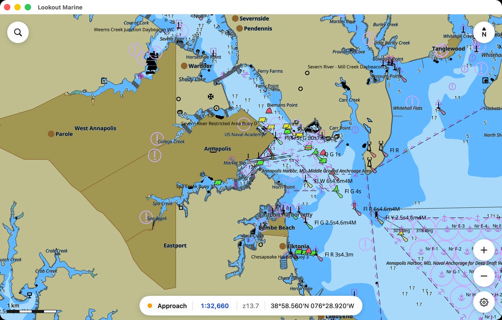
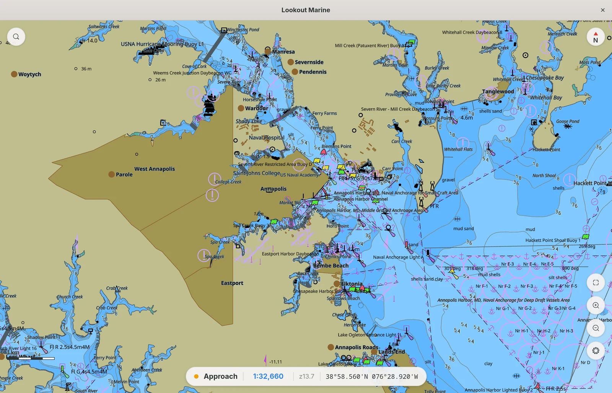
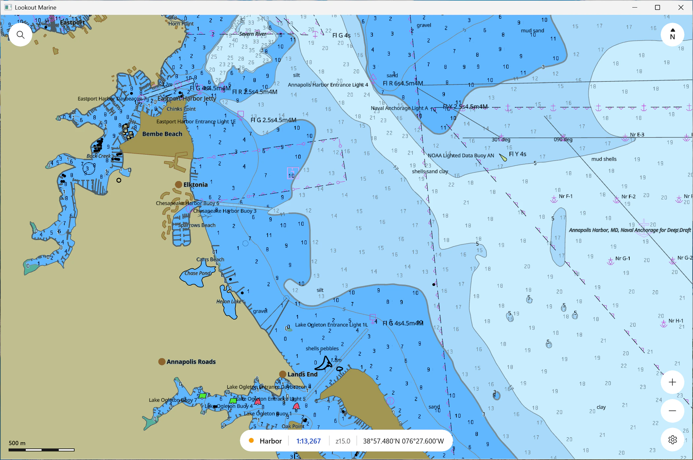
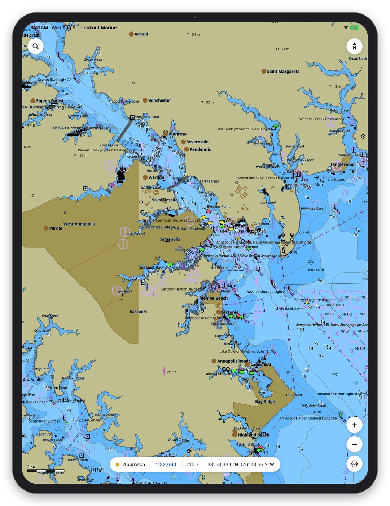
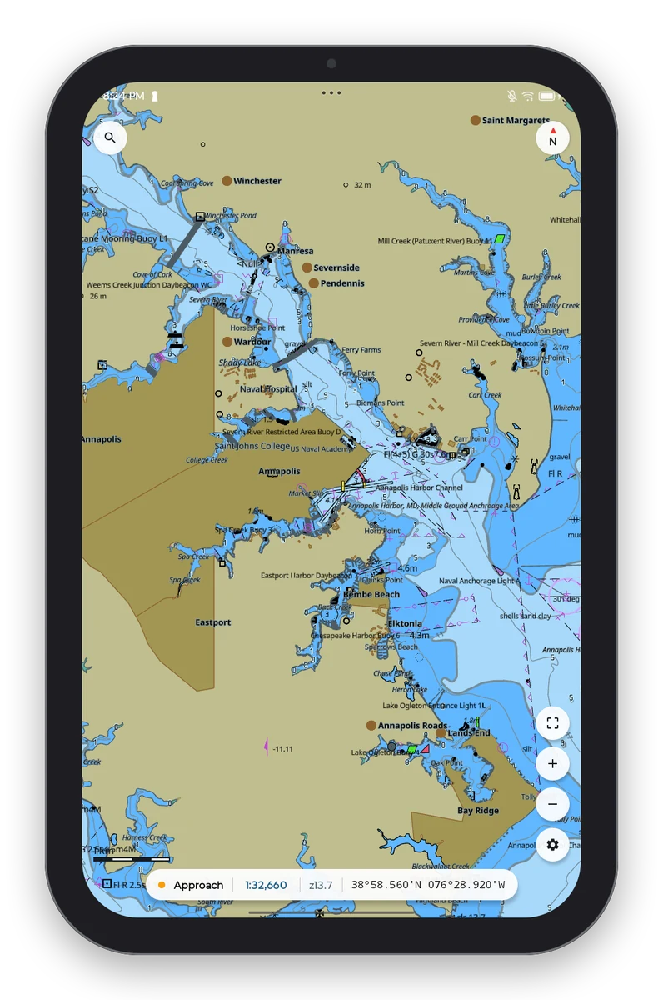
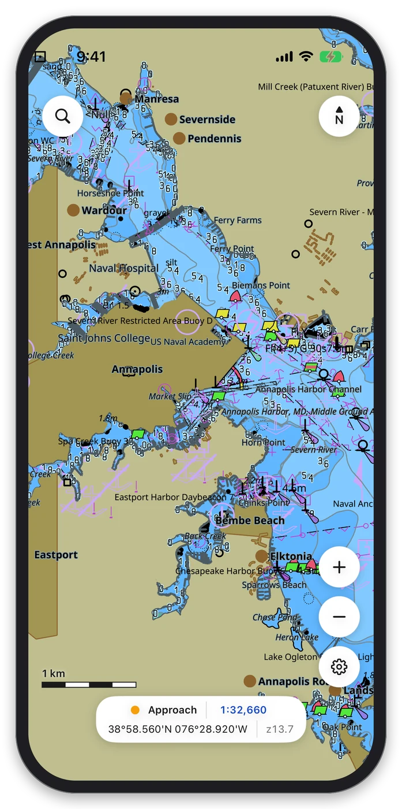

# Lookout Marine

**A chartplotter that renders official ENC charts at 60 fps, native on six platforms.**

> **Not for navigation. Not an ECDIS.** Lookout is a prototype. It is not certified, not type approved, and it has never been through conformance testing. It implements as much of the IHO standards as makes sense for recreational boating.

<table>
  <tr valign="top">
    <td align="center"><b>macOS</b> · SwiftUI<br></td>
    <td align="center"><b>Linux</b> · GTK4<br></td>
    <td align="center"><b>Windows</b> · WinUI 3<br></td>
  </tr>
</table>

<table>
  <tr valign="top">
    <td align="center"><b>iPadOS</b> · SwiftUI<br></td>
    <td align="center"><b>Android</b> · Jetpack Compose<br></td>
    <td align="center"><b>iOS</b> · SwiftUI<br></td>
  </tr>
</table>

## Installing Lookout

| Platform | How to install |
|---|---|
| macOS 26 or later, Apple silicon | `brew install --cask beetlebugorg/tap/lookout-marine` |
| Ubuntu 24.04 or later, amd64 or arm64 | `sudo apt install ./lookout-marine_0.1.0_amd64.deb` |
| Windows 10 1809 or later, x64 | Unzip `LookoutMarine-0.1.0-windows-x64.zip`, run `LookoutMarine.exe` |
| Android 7 or later, arm64 | Install `LookoutMarine-0.1.0-android-arm64.apk` |
| iPhone and iPad | Build it with Xcode. Refer to [the build notes](https://beetlebugorg.github.io/lookout-marine/developer-guide/macos) |

Downloads are on the [latest release](https://github.com/beetlebugorg/lookout-marine/releases/latest).

## Getting charts

Open NOAA's `All_ENCs.zip`, or a folder of cells. Lookout prepares the whole download itself, with no separate tool to run, and opens it as one library, then renders the most detailed chart at each point and stitches the seams. Any unencrypted S-57 cell works. S-63 does not, yet.

- **ENC cells.** [NOAA](https://charts.noaa.gov/ENCs/ENCs.shtml) publishes United States waters at no cost.
- **Satellite imagery and raster sheets.** MBTiles and BSB/KAP render under the ENC, which drops its depth shading where they cover. Cruisers publish MBTiles for the coasts the ENC covers poorly. Two large free collections are [The Chart Locker](https://chartlocker.brucebalan.com/) and [SV Ocelot](https://hackingfamily.com/Cruise_Info/Equipment/Chart_Downloads.htm).
- **MapLibre styles.** Paste a style link and Lookout renders that map as the chart. For [Seascape](https://openwaters.io/charts/seascape/), global open bathymetry with a nautical style, the link is [tiles.openwaters.io/seascape/style.json](https://tiles.openwaters.io/seascape/style.json).

## 60 fps on every platform's own GPU

Metal on Mac, iPad and iPhone. Direct3D 12 on Windows. Vulkan on Linux and Android. The chart reaches the GPU through the platform's own API, with no abstraction layer in between, and holds 60 fps while you drag, pinch, rotate and switch to night.

A boat runs off a battery, so power is a rule throughout: nothing repaints without a reason to repaint, and no timer keeps running once it has nothing left to report. An idle chart uses no CPU.

## Every symbol comes from the IHO catalog

Lookout runs the S-101 Portrayal Catalogue, the standard's own Lua rules, against the features in the cell. Those rules decide every symbol, color and label on the chart.

You get the settings that go with them: day, dusk and night palettes, display categories, two or four depth shades, your safety contour and safety depth, text and light-sector switches, a data-quality overlay. Refer to [mariner settings](https://beetlebugorg.github.io/lookout-marine/user-guide/mariner-settings).

## Ready for S-101 before the charts are

A native S-101 dataset renders directly. An S-57 cell converts into the same model and renders with the same catalog. When your hydrographic office publishes S-101, the conversion drops out and nothing else changes.

## Extend it with plugins

Lookout ships with plugins for own ship, AIS, NMEA 0183, Signal K and laylines, so a gateway on the boat's network puts your position, your instruments and the traffic around you on the chart, with an alarm for a vessel that will pass close.

A plugin is a WebAssembly module in a sandbox, with a manifest stating what it may reach. It can read the boat's data, publish its own, and render its own geometry on the chart. Write one in Zig, Go or Rust. Refer to [the plugin guide](https://beetlebugorg.github.io/lookout-marine/developer-guide/plugins/).

## Six native apps, written with AI

A single cross-platform toolkit feels slightly wrong on every platform, and separate native apps drift apart as soon as one gains a feature first. AI removes that trade-off. Everything portable sits in a Zig core behind one C ABI, and above it each platform gets a real native app, written and kept in step with AI: SwiftUI on Apple, WinUI 3 on Windows, GTK4 on Linux, Compose on Android. There is no shared widget layer and no web view.

Every app is then captured under [one protocol](https://beetlebugorg.github.io/lookout-marine/developer-guide/screenshots), the same chart at the same camera and window size, so the platforms are compared frame to frame.

## For developers

```sh
zig build && zig build plugins && zig build test
```

The core is a static library with a C ABI ([`include/lookout.h`](include/lookout.h)), so you can put a chart in your own native app. The architecture, the host notes and the plugin guide are in [the documentation](https://beetlebugorg.github.io/lookout-marine/).

Two pieces of it are projects of their own, each a Zig library behind its own C ABI. [tile57] is the chart engine: ISO 8211 and S-57 decode, the conversion to S-101, the portrayal catalog, and the tiles it bakes from a cell. [charttable] is the renderer: it renders a MapLibre style and its vector tiles on the GPU through Metal, Vulkan or Direct3D 12, which is also what puts a pasted style link on screen as the chart.

Contributions are welcome, and so are AI tools. A clear set of requirements, or a rough prototype of what you want, is more useful than a patch.

MIT licensed. Refer to [LICENSE](LICENSE).

[tile57]: https://github.com/beetlebugorg/tile57
[charttable]: https://github.com/beetlebugorg/charttable
