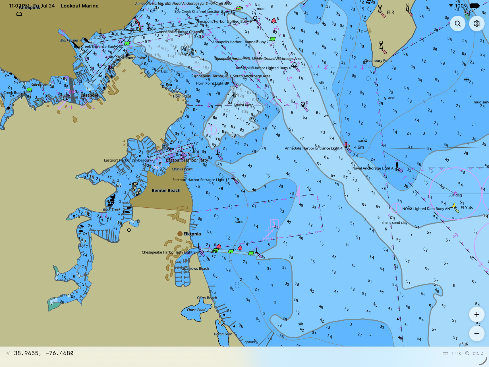
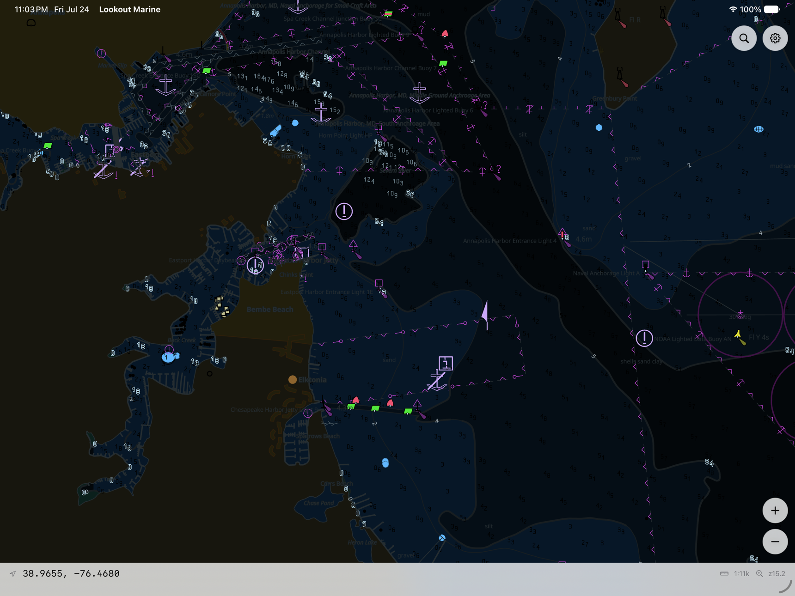

# Lookout Marine

A native **chartplotter app for Mac, iPad, and iPhone**. It draws real S-52
electronic nautical charts (NOAA ENC / S-57) directly with Metal and stays fluid
at **60 fps** — pan, pinch-zoom, rotate, and day/night switching never stutter
and never wait on a rebuild.

> **Not for navigation.** This is a prototype / proof-of-concept. It is not
> S-52 pixel-perfect and makes no claim of ECDIS correctness.



## What you can do with it

- **Read real charts, properly drawn.** Depth areas and contours, buoys and
  beacons with correct symbology, lights with sector lines, soundings, anchorage
  and restricted areas, place names — full **S-52 portrayal** of stock NOAA ENC
  cells, straight from the source data.
- **Move around like a chartplotter should.** One-finger pan with fling, pinch
  zoom anchored under your fingers, two-finger rotate, double-tap to zoom, and
  tap-to-identify any feature. On iPad and Mac, pointer/trackpad and cursor
  readouts too.
- **Open a whole coastline, not just one chart.** Point it at a folder — or drop
  cells into the app on iPhone/iPad — and Lookout stitches them into one seamless
  chart, from a single harbor to a 7,000-cell coastline, without ever freezing.
- **Flip between day, dusk, and night** instantly — the scheme changes the moment
  you tap it, with no reload.
- **Tune the chart to your eye.** The full S-52 mariner panel: safety, shallow,
  and deep contours, safety depth, two- or four-shade water, display categories,
  sounding and text toggles, symbol sizing, date-dependent features — applied
  live as you change them.
- **Jump to a position** by typing coordinates into search
  ("38 58.5N 76 28.9W" and friends).



## Loading charts

Lookout opens **chart archives** baked from the S-57 ENC cells that hydrographic
offices give away for free — for the US, the entire NOAA ENC catalogue is one
download.

- **On Mac:** **File ▸ Open Chart…** opens a single chart or a whole folder of
  them.
- **On iPhone / iPad:** import cells through the Files picker; everything in the
  app's Documents folder is composed into your chart library at launch.

Charts are baked with the [tile57] engine's command-line tool:

```sh
tile57 bake CELL.000 -o out/      # one cell
tile57 bake ENC_ROOT -o out/      # a whole ENC_ROOT -> a ready chart library
```

## Getting the app

There's no App Store build yet — you build it from source with **Xcode**
(macOS 14+ SDK; iOS deployment floor 15.0). You'll also need **Zig 0.16**
(`brew install zig`) and **XcodeGen** (`brew install xcodegen`).

```sh
cd macos
xcodegen generate          # writes LookoutMarine.xcodeproj from project.yml
open LookoutMarine.xcodeproj
```

Pick the **LookoutMarine** (Mac) or **LookoutMarine-iOS** target and Run. The
pre-build phase runs `zig build`, which pulls in the chart engine and installs
everything the app links against — nothing needs to be pre-built. For a fully
non-debug app, use Xcode's Release configuration.

No Xcode? `macos/build-dev.sh --zig` builds the Mac app with just the Command
Line Tools into `macos/build/`.

---

## Under the hood

Lookout is a thin native app over a shared **chart core written in Zig**. The
core opens a baked chart or library, asks the engine for a **draw-ready GPU
scene** (vertices, quads, paint order, per-scheme colour buffers), uploads it
once, and then renders every frame by updating a single uniform block — camera,
palette, display-category gates, and SCAMIN culling all happen in the vertex
shader. That's why panning and day/night switching never re-tessellate: the work
is done once, and each frame is a uniform update. Rendering is direct Metal
(`src/metal_shim.m` owns the device and pipelines; `shaders/lookout.metal` is
compiled at runtime, so there's no offline shader toolchain).

The **app shell** (`macos/`) is SwiftUI — menu bar, HUD, zoom controls, the
mariner settings panel, search — wrapped around one GPU-rendered chart view and
driven through the core's C ABI. Mac and iOS/iPadOS share the Swift sources; iOS
adds a UIKit gesture surface under a pass-through chrome window. See
`macos/README.md` for the app architecture and gotchas.

The heavy lifting — S-57 decoding, S-101 portrayal (embedded Lua rules),
tessellation, sprite/SDF atlases, tile compositing — lives in the **[tile57]**
engine, consumed here as a Zig package dependency: a sibling `../tile57` checkout
is used when present, otherwise the commit pinned in `build.zig.zon` is fetched
automatically, and `libtile57.a` is built from source inside `zig build`.

[tile57]: https://github.com/beetlebugorg/tile57

## For developers: building & embedding the core

The chart core builds and runs on its own, and is embeddable in any native app:

```sh
zig build                  # ReleaseFast by default; -Doptimize=Debug to develop
zig build test             # unit tests
```

`zig build` installs `liblookout_marine.a`, `libtile57.a`, `lookout.h`, and
`tile57.h` into `zig-out/`. To embed: create a native view, hand its
`CAMetalLayer` to `lookout_open_in_window(LOOKOUT_NATIVE_METAL_LAYER, …)`, and
drive it with `lookout_render` / `lookout_pan` / `lookout_zoom_at` /
`lookout_set_mariner` etc. — see `include/lookout.h`. Headless consumers can skip
the window and pull frames with `lookout_snapshot_rgba`.

`zig-out/bin/lookout-marine-demo` is the render-parity and smoke-test harness
(not the app): it renders a chart to day / night / zoomed PNGs and exits.

```sh
./zig-out/bin/lookout-marine-demo chart.pmtiles [--png out.png] [--lon L --lat L --zoom Z]
```

Two launch-time conveniences help when iterating: `LOOKOUT_OPEN=<chart|dir>`
opens something at startup, and `LOOKOUT_VIEW=lon,lat,zoom[,rot]` pins the
opening camera (both forwarded by `simctl launch` as `SIMCTL_CHILD_*` — how the
screenshots above were captured).

### Layout

```
build.zig, build.zig.zon   build + the tile57 dependency pin
include/lookout.h          C ABI (the Swift<->Zig bridge)
shaders/lookout.metal      all four pipelines, compiled at runtime
src/camera.zig             web-mercator camera math (MVP, screen<->geo, SCAMIN)
src/root.zig               Lookout: scene lifecycle, worker-thread rebuilds
src/gpu.zig                Metal transport: pipelines, buffers, per-frame render
src/metal_shim.{h,m}       the ObjC Metal/CAMetalLayer shim behind a C face
src/atlas.zig, src/png.zig sprite/SDF atlas load, PNG encode
src/capi.zig, src/main.zig C ABI wrapper; the headless demo
macos/                     the SwiftUI app (macOS + iOS/iPadOS), XcodeGen spec
vendor/stb                 stb_image (atlas PNG decode)
```

The SDL3/`SDL_GPU`/Vulkan/MoltenVK predecessor of this renderer — and every
driver workaround it accumulated — lives at the `sdl-gpu` git tag.

## AI-First Development

This project is built with AI assistance. We encourage contributors to use AI tools for
development and to contribute by providing clear requirements and/or a prototype of what
they'd like rather than code.

## License

MIT — see `LICENSE`.
