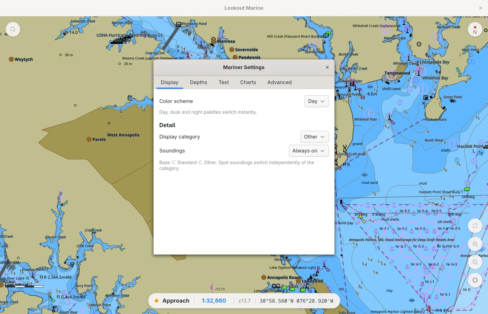

# Linux

A native **GTK4** shell in C around the Zig chart core. The core draws with **raw
Vulkan** (`src/gpu_vk.zig`) into a surface that the compositor shows. It is the
equivalent of the SwiftUI shell and the Java shell: same core, same C ABI, same
behaviour.


The titlebar carries the name of the app and the window controls, and nothing
else. Every control that acts on the chart is a bubble above the chart, which is
where the SwiftUI shell, the WinUI 3 shell, and the Compose shell put it. No
control is in two places, and the chart gets the whole window.

The layout is the layout of every host:

| Position | Content |
|---|---|
| Top left | The search control, and the commands control beside it. |
| Top right | The compass, which is also the follow lock. |
| Bottom right | Fit, zoom in, zoom out, the display menu, and the settings control. |
| Bottom left | The distance bar. |
| Bottom center | The readouts capsule. |
| Top center | The build indicator, and the plugin alerts above it. |

The commands control holds the items that the macOS menu bar holds, in the same
order and in the same words. Linux has no menu bar outside the window, and a menu
bar inside it takes a strip of water on every screen. The list is built at each
press, because most of it names things that come and go: the charts opened
lately, the raster sets that cover this view, and the tables the plugins declare.

The readouts capsule shows the navigational purpose band, the scale, the zoom, and
the position of own ship. An amber badge appears beside them when the view is
finer than the data permits. The scale is also a control: a click opens the scale
entry, where you type a scale or select a band. A narrow window drops the band and
takes a smaller type, which is the rule the phone shells use.

## Reading the position of own ship

The position readout carries own ship and nothing else. It does not follow the
center of the view, and it does not change meaning when the mariner pans away.
A pan is when a mistaken value is dangerous.

A pill beside the numbers says how much to believe them, and it differs by more
than its words, so it reads at a glance in bad light:

| State | The pill | The numbers |
|---|---|---|
| A fix inside its freshness window | **GPS**, filled | The reported position |
| A source that stopped answering | **NO GPS**, outlined in red | None |
| No source of position at all | **Configure GPS**, outlined | None |

The third state carries the fix. A click opens the mariner settings at
**Connections**, which is where a position source is added.

The coordinates of a PLACE come from the chart menu instead. A secondary click
on the water opens it, and every item acts on the point under the press.

## Following own ship

The compass is the follow lock. A click always locks the chart to own ship, and
once locked it cycles north up and course up. The letter names what is up: N, or
C once the chart turns with the ship. Under N the mark turns with the view and
points at north; under C the course is up by definition, so the mark stands still.

The bubble carries a ring while follow waits for a fix, and a fill once it has
one. The two states must be distinct, because one of them means the instrument
feed is the thing to look at.

The core owns both parts. It drops follow on a pan and course up on a rotation by
hand, so the shell reads the state off the engine with the other readouts and
never remembers it from a click.

## How the pick report is composed

The chart menu raises the report: a secondary click, or a held finger, then
**Pick Report**. A plain click never picks — a stray click while panning used
to throw a report nobody asked for. The report opens beside a mark at the
menu's point.

The **engine** composes the report. The core emits `{"report":…,"s57":…}` for each
picked feature, which is the decoded page beside the raw payload. Every shell only
parses that and lays it out; `tile57_s57_report` decides what a mariner reads, one
time, for all of them. The app calls `lookout_pick_ranked`, so the core also
removes the meta objects that say nothing, demotes a feature that has no
attributes, and states each depth in the unit of the mariner.

The card shows the operative fact as the title, what the object is under it, the
notes of the cell first, then the attributes in chart language. The provenance is
one line at the foot. The raw S-57 rows are one fold below that, and the copy
control puts them on the clipboard, which is how you report a problem with a
chart. A pick that finds several objects gets a column of them beside the report.

The card stands above the mark, or below it when the space above is too small. It
never covers the readouts, and a long report scrolls instead of growing. Any
movement of the camera retires the report, so it never floats above water that it
does not describe. **Escape** closes it.

GLib has no JSON reader, and json-glib is not a dependency of GTK. Therefore
`src/lk-json.c` reads the payload. It is small, and it adds no prerequisite for a
packager.

## Handling what the plugins put on the chart

A plugin draws vessels and gives each symbol a payload. A click on a symbol pins
a bubble to it and does not open the chart pick report: the mariner clicked the
target, not the water under it. The bubble follows the object, refreshes its
values, and closes itself when the object ages out or its plugin stops.

A plugin raises alerts, and severity is the whole contract. An alarm is audible
and repeats every ten seconds until somebody acknowledges it. A warning and a
notice are shown and never sounded. A marine alarm does not time out, and looking
at it is not acknowledging it. Acknowledging silences one alert and no other: a
mariner who has seen the vessel crossing ahead has not seen the one astern.

The strip stands at the top center and shows two alerts, then a count. It must
not cover the water the alarm is about.

The tone is synthesized at run time rather than shipped as an asset, so no
packager can drop it. GTK plays it through a media stream; where the build has no
media backend, the window's bell stands in and the log says so once.

A plugin can also declare a TABLE, and the shell puts one window behind
**Commands ▸ Vessels**. The columns are typed, which is what makes sorting
honest: distance is metres, speed metres per second, bearing degrees true and
duration seconds. The plugin sends SI and the shell prints nautical miles, knots
and degrees. The core sorts within a band and never across one, so an alarmed
vessel keeps the top line whatever column the mariner sorts by.

## Installing a plugin

A `.lkplug` is a package: a manifest and one wasm module. **Settings ▸ Plugins ▸
Install Plugin…** takes one, and dropping one on the chart asks the same
question. The core reads the package without installing it, and the consent sheet
lists what it will be able to do in the core's own sentences. Nothing touches the
disk until Install, and Cancel deletes nothing.

Reinstalling an id calls out the delta: what the new package asks for that the
running copy did not, what it no longer asks for, and whether it is a downgrade.
The core refuses a package that claims a bundled plugin's id, and the sheet shows
that reason instead of offering Install.

**Settings ▸ Plugins** manages what is loaded. Each plugin is one row with its
live status, and the disclosure holds the rest: where the copy came from, a
switch per capability, and Uninstall for what an install wrote. A grant can never
exceed the manifest, so a switch only takes something away. The broker checks
every mediated call, so a revoked capability answers the plugin -1 and the plugin
keeps running.

## Opening a file a plugin reads

A manifest claims file types, and a weather file the mariner opens belongs to the
plugin that reads them. Every way in routes the same way: **Ctrl+Shift+O** and a
drop on the window both offer the file to the plugins before the shell treats it
as a chart. The core answers which, so the app never matches an
extension itself. A chart always answers 0, and so does a build with no plugin
layer, which is why one code path serves both.

## Marking a place

The mariner's own mark is a rock somebody reported, a crab pot, or an anchorage
to come back to. A secondary click on the water opens the chart menu, and **Drop
Mark** places it. The drop never waits for typing: the core places the mark and
names it in one call, because a mariner drops a mark one-handed on a moving boat.
Over an existing mark the menu offers a rename field and **Remove Mark** in place
of Drop.

The core owns the marks. It draws them, writes them under the per-user directory
and reads them back at every open, so they survive a restart and a change of
chart library. This shell stores nothing.

## Using the mariner panel

The full mariner panel is a separate window. Press **Ctrl+,** to open it. The
panel is not modal, and the chart stays usable while the panel is open. The panel
applies each edit after a short delay, and it keeps each value.

The sections stand in a sidebar, as they do on macOS: Display, Depths, Text and
Charts, then Vessels, Alarms and Connections while a plugin puts something in
them, then Plugins and Advanced. The list is the navigation, so it carries no
collapse control. The line under it states the one promise the whole window
makes: each edit applies at once, and it is kept for the next launch.



## Handling raster charts

The engine draws the [raster charts](../user-guide/raster-charts.md) below the
ENC. The shell supplies the list and the controls. The keys are the macOS keys
with Ctrl for Command.

| Control | Function |
|---|---|
| **Ctrl+I** | Step to the next set covering this water, then to no picture. |
| **Ctrl+Shift+I** | Add raster charts. It also answers Ctrl+I when nothing is installed. |
| **Ctrl+Shift+H** | Hide the ENC where a picture covers it, and show it again. |
| The pill | The last item in the readouts capsule. A click opens the list. |
| Settings ▸ Charts | Add a folder, switch one set or one file off, and remove one. |

The pill appears wherever a raster chart is in view, and it goes when the mariner
leaves the coverage. It names the set drawn over this view. The COLOUR reports the
raster chart, not the ENC: the accent colour while the picture draws, amber while
one covers the view and is off. Hiding the ENC above it keeps the accent colour,
because the picture is still drawn; the "ENC OFF" text carries that.

`src/lk-raster.c` holds the installed list and the on/off state. **The list must
live in the shell.** The engine holds what is open now, and a raster chart belongs
to one `lookout*` handle. A chart set has to outlive both a change of ENC and a
restart, so the list is persisted in `settings.ini` and
`lk_chart_controller_open` replays it into each new handle. That file also mirrors
the engine's set-name rule (`raster.zig setNameFor`), so the name the settings
form prints is the name the pill cycles.

Which sets cover the view changes as the mariner sails, so the state is read off
the engine with the other readouts, at 10 Hz. Anything that changes the selection
outside a frame (a switch in the settings panel, a chart added) reads it back at
once, because the readouts only run while the chart renders and the panel can be
open over a chart that is standing still.

## How the chart gets onto the screen

This part is unlike the other hosts. Three designs were necessary.

GTK does not draw the chart. Vulkan draws the chart into its own Wayland
subsurface. The host puts that subsurface **below** the GTK window. The chart
widget (`LkChartView`) then draws nothing. The widget leaves its area fully
transparent. The area is a hole in the window, and the compositor shows the chart
through the hole. GTK draws all of the other widgets above the hole in the normal
way.

```
  compositor stacking          GTK window buffer (RGBA)
  ┌──────────────────────┐     ┌──────────────────────────┐
  │  GTK window  (top)   │ ──▶ │ headerbar   (opaque)     │
  │                      │     │ ╌╌╌ chart area ╌╌╌       │  <- transparent hole
  │                      │     │ HUD bar, zoom (opaque)   │
  ├──────────────────────┤     └──────────────────────────┘
  │  chart subsurface    │
  │  (Vulkan swapchain)  │
  └──────────────────────┘
```

This design gives two results:

- **The compositor shows the chart directly.** Therefore the chart is sharp. This
  is also true on a display that uses a fractional scale, because the compositor
  makes the final size change in one step.
- **GTK keeps control of its own stacking.** Therefore the chrome floats in the
  same way as on macOS and iPad. The chart widget is the base of a `GtkOverlay`.
  The HUD, the zoom buttons, and the compass are overlays above it. This is normal
  GTK behavior.

Input needs no special code. The hole is still part of the GTK window, so the
compositor sends the pointer and key events to it.
GTK sends them to the gesture controllers of the chart widget. The controllers then
call the core (`lookout_pan`, `lookout_zoom_at_logical`, and others). The core
returns its readouts through the controller to the app model, and the HUD shows
them.

### Two earlier ways of getting the chart on screen

Both worked. Each failed one of the two requirements above.

**Design 1: the subsurface above the window.** This design put the subsurface above
the GTK window. The chart was sharp. However, a subsurface composites above the
full widget tree. Therefore GTK could draw nothing above the chart. The HUD became
a status bar below the chart, and the zoom controls moved into the headerbar. The
surface also had to pass input through. On Wayland it needed an empty input region.
On X11 it needed `event_mask = 0`.

**Design 2: the chart as a `GdkTexture`.** The core drew the chart offscreen. Then
the core exported the frame as a dmabuf. It used
`VK_EXT_image_drm_format_modifier` and `VK_KHR_external_memory_fd`. GTK imported
the frame as a texture node in its scene graph. The chrome floated correctly, and
the pixels stayed on the GPU. However, GTK then resampled the frame when it
composited the frame into a window that uses a fractional scale. The result was
visibly soft. No render density corrected this problem. The native scale, an integer
scale of 2, and a 2x supersample with a box filter were each soft.

Design 2 also had a problem on a machine with two GPUs. The core had to use the GPU
that drives the display. The discrete card cannot import a dmabuf that the
integrated GPU exports, because the integrated GPU uses a private tiling format
(`Y_TILED_CCS`).

Design 2 is removed. One part of it remains in the core: the offscreen Vulkan
device selects a **discrete** GPU first. This is still the correct default.

## Rendering each frame

The core makes the Vulkan instance, the device, and four pipelines (chart, sprite,
SDF, and pattern) from precompiled SPIR-V. The core opens with
`LOOKOUT_NATIVE_WAYLAND_SURFACE` or `LOOKOUT_NATIVE_X11_WINDOW`. Then the core
draws into a swapchain with 4x MSAA. The core is a static library, and it does not
load the Vulkan loader. Therefore this executable links `libvulkan`.

The chart stays a vector image until the rasterizer draws it. tile57 tessellates
the S-57 geometry one time. Each frame is then a uniform update. The vertex shader
applies the camera, the palette, and the SCAMIN limits. The core does not make a
bitmap of the chart and does not cache one.

The render loop runs only when it is necessary. It is the equivalent of the display
link on macOS. A GTK frame-clock callback runs while an animation is active or
while the scene is not clean. The callback removes itself when the chart is static.
Therefore a static chart uses no CPU time. All of the code runs on the main thread,
because the engine permits only one thread and GTK requires the main thread.

## Before you build

- **GTK 4.14** or later, the **Vulkan** headers, a Vulkan loader, and the X11 or
  Wayland client libraries.
- **Zig 0.16** on `PATH`. **meson** and **ninja**.

```sh
sudo apt install libgtk-4-dev libvulkan-dev libx11-dev libwayland-dev \
                 meson ninja-build          # Debian/Ubuntu
sudo pacman -S   gtk4 vulkan-headers vulkan-icd-loader libx11 wayland \
                 meson ninja                # Arch
```

tile57 is not a prerequisite. It is a Zig package dependency of the core. If a
sibling `../../tile57` checkout is available, the build uses it. If it is not
available, the build gets the commit that `../build.zig.zon` specifies.

## Building and running

```sh
cd linux
meson setup build
ninja -C build
./build/lookout-marine
```

`meson` runs `build-core.sh`. That script runs `zig build lib -Dbackend=vk`. Then
it copies `liblookout_marine.a`, `libtile57.a`, `lookout.h`, and `tile57.h` into
the build directory. The core is always `ReleaseFast`. Use `-Dcore-optimize=Debug`
if you must debug the core. The app must hold 60 fps, and a Debug core loses
frames.

You need a baked `.pmtiles` chart. Use **Open** in the headerbar to select a folder
of cells. At the first start, the app looks for `$LOOKOUT_OPEN`. Then it looks for
the saved chart library. Then it looks for
`~/.cache/chartplotter/NOAA/tiles/d5/US5MD1MC.pmtiles`. Set
`$LOOKOUT_VIEW="lon,lat,zoom[,rot]"` to select the first camera position.

## Where the code lives

| File | Function |
|------|----------|
| `src/main.c` | The `GtkApplication` entry point, the CSS, and the accelerators |
| `src/lk-window.c` | The window: the titlebar, the chart, the floating chrome, the actions, and the open dialog |
| `src/lk-chart-view.c` | The chart widget. It owns the surface, the transparent hole, and all input. |
| `src/lk-chart-controller.c` | The one `lookout*` handle, every `lookout_*` call, and the render loop |
| `src/lk-native-surface.c` | The X11 child window or the Wayland subsurface that the chart draws into |
| `src/lk-app-model.c` | The shared state, the recents, the open paths, and the coordinate and scale parsers |
| `src/lk-hud.c` | The readouts capsule, the distance bar, the north control, the scale entry, and the formats |
| `src/lk-pick-report.c` | The pick report: the decode, the card, and the placement of the callout |
| `src/lk-raster.c` | The installed raster charts, their on and off, and the set names |
| `src/lk-json.c` | The JSON reader for the payload of a pick |
| `src/lk-search.c` | The coordinate go-to function. Feature search is not complete. |
| `src/lk-mariner.c` | The live `tile57_mariner` behind the settings form |
| `src/lk-settings-window.c` | The mariner panel (Display, Depths, Text, Charts, Advanced) |
| `src/lk-store.c` | The camera position, the recents, and the settings in one XDG keyfile |
| `build-core.sh` | It builds the Zig core where meson expects the outputs. |
| `screenshots.sh` | It makes the documentation screenshots. Refer to [the protocol](screenshots.md). |

## What to watch out for

- **Two GPUs.** The offscreen Vulkan device selects a discrete GPU first. The
  device that draws to the screen must be able to drive the surface. The loader
  lists that device first for a surface instance.
- **X11 deprecations.** GTK 4.18 deprecated the full X11 backend API and supplied
  no replacement. Therefore the X11 code builds with two warnings
  (`gdk_x11_display_get_xdisplay` and `gdk_x11_surface_get_xid`). These two
  functions are the only way to get the X window of a `GdkSurface`. The warnings
  stay visible for this reason.
- **The Wayland swapchain size.** A Wayland surface reports an undefined
  `currentExtent`. Therefore the core calculates the swapchain size from the points
  and the density that the host declares. It does not use the surface size.
- **The swapchain color format.** The palette gives the shader colors that are
  already sRGB. An `_SRGB` swapchain would encode them a second time, and the chart
  would look too pale. Therefore the core selects a UNORM order first, then any
  format that is not `_SRGB`.

## Not complete yet

- **Feature search and place-name search.** The coordinate go-to function works.
  Name search is not complete, and the control shows "coming soon". It needs a name
  index in tile57 and a new `lookout_*` query. We do not show false results.
- **The desktop entry, the icon, and the packages.** The build installs only the
  executable.
- **Automatic input tests on Wayland.** No tool here can send events to a
  compositor. The fling gesture, the rotate gesture, the cursor pick, and an
  integer scale above 2 also have no automatic tests.
