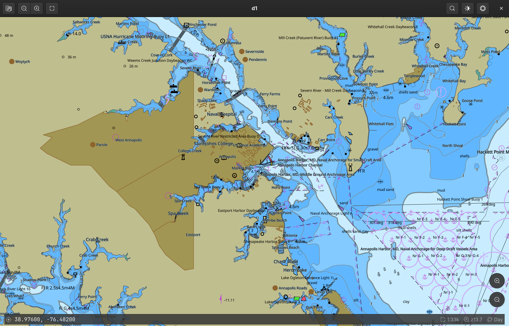
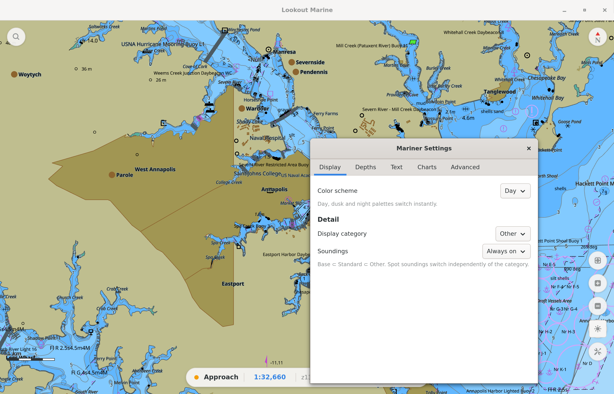

# Linux

A native **GTK4** shell in C around the Zig chart core. The core draws with **raw
Vulkan** (`src/gpu_vk.zig`) into a surface that the compositor shows. It is the
equivalent of the SwiftUI shell and the Java shell: same core, same C ABI, same
behaviour.



The left side of the headerbar has the open control, the recents list, the zoom
controls, the fit control, and the north-up control. The right side has the search
control, the display menu, and the settings control.

The chrome floats above the chart. The HUD bar shows the coordinate of the pointer,
or the coordinate of the center. It also shows an amber overscale badge when the
view is finer than the data permits, then the scale, the zoom, and the scheme. The
zoom buttons and the compass are above the corners of the chart.

The full mariner panel is a separate window. Press **Ctrl+,** to open it. The
panel is not modal, and the chart stays usable while the panel is open. The panel
applies each edit after a short delay, and it keeps each value.



## How the chart gets onto the screen

This part is unlike the other hosts. Three designs were necessary.

GTK does not draw the chart. Vulkan draws the chart into its own Wayland
subsurface. The host puts that subsurface **below** the GTK window. The chart
widget (`LkChartView`) then draws nothing. The widget leaves its area fully
transparent. The area is a hole in the window, and the compositor shows the chart
through the hole. GTK draws all of the other widgets above the hole in the normal
way.

```
  compositor stacking          GTK window buffer (RGBA)
  ┌──────────────────────┐     ┌──────────────────────────┐
  │  GTK window  (top)   │ ──▶ │ headerbar   (opaque)     │
  │                      │     │ ╌╌╌ chart area ╌╌╌       │  <- transparent hole
  │                      │     │ HUD bar, zoom (opaque)   │
  ├──────────────────────┤     └──────────────────────────┘
  │  chart subsurface    │
  │  (Vulkan swapchain)  │
  └──────────────────────┘
```

This design gives two results:

- **The compositor shows the chart directly.** Therefore the chart is sharp. This
  is also true on a display that uses a fractional scale, because the compositor
  makes the final size change in one step.
- **GTK keeps control of its own stacking.** Therefore the chrome floats in the
  same way as on macOS and iPad. The chart widget is the base of a `GtkOverlay`.
  The HUD, the zoom buttons, and the compass are overlays above it. This is normal
  GTK behavior.

Input needs no special code. The hole is still part of the GTK window, so the
compositor sends the pointer and key events to it.
GTK sends them to the gesture controllers of the chart widget. The controllers then
call the core (`lookout_pan`, `lookout_zoom_at_logical`, and others). The core
returns its readouts through the controller to the app model, and the HUD shows
them.

### Two earlier designs

Both worked. Each failed one of the two requirements above.

**Design 1: the subsurface above the window.** This design put the subsurface above
the GTK window. The chart was sharp. However, a subsurface composites above the
full widget tree. Therefore GTK could draw nothing above the chart. The HUD became
a status bar below the chart, and the zoom controls moved into the headerbar. The
surface also had to pass input through. On Wayland it needed an empty input region.
On X11 it needed `event_mask = 0`.

**Design 2: the chart as a `GdkTexture`.** The core drew the chart offscreen. Then
the core exported the frame as a dmabuf. It used
`VK_EXT_image_drm_format_modifier` and `VK_KHR_external_memory_fd`. GTK imported
the frame as a texture node in its scene graph. The chrome floated correctly, and
the pixels stayed on the GPU. However, GTK then resampled the frame when it
composited the frame into a window that uses a fractional scale. The result was
visibly soft. No render density corrected this problem. The native scale, an integer
scale of 2, and a 2x supersample with a box filter were each soft.

Design 2 also had a problem on a machine with two GPUs. The core had to use the GPU
that drives the display. The discrete card cannot import a dmabuf that the
integrated GPU exports, because the integrated GPU uses a private tiling format
(`Y_TILED_CCS`).

Design 2 is removed. One part of it remains in the core: the offscreen Vulkan
device selects a **discrete** GPU first. This is still the correct default.

## Rendering

The core makes the Vulkan instance, the device, and four pipelines (chart, sprite,
SDF, and pattern) from precompiled SPIR-V. The core opens with
`LOOKOUT_NATIVE_WAYLAND_SURFACE` or `LOOKOUT_NATIVE_X11_WINDOW`. Then the core
draws into a swapchain with 4x MSAA. The core is a static library, and it does not
load the Vulkan loader. Therefore this executable links `libvulkan`.

The chart stays a vector image until the rasterizer draws it. tile57 tessellates
the S-57 geometry one time. Each frame is then a uniform update. The vertex shader
applies the camera, the palette, and the SCAMIN limits. The core does not make a
bitmap of the chart and does not cache one.

The render loop runs only when it is necessary. It is the equivalent of the display
link on macOS. A GTK frame-clock callback runs while an animation is active or
while the scene is not clean. The callback removes itself when the chart is static.
Therefore a static chart uses no CPU time. All of the code runs on the main thread,
because the engine permits only one thread and GTK requires the main thread.

## Prerequisites

- **GTK 4.10** or later, the **Vulkan** headers, a Vulkan loader, and the X11 or
  Wayland client libraries.
- **Zig 0.16** on `PATH`. **meson** and **ninja**.

```sh
sudo apt install libgtk-4-dev libvulkan-dev libx11-dev libwayland-dev \
                 meson ninja-build          # Debian/Ubuntu
sudo pacman -S   gtk4 vulkan-headers vulkan-icd-loader libx11 wayland \
                 meson ninja                # Arch
```

tile57 is not a prerequisite. It is a Zig package dependency of the core. If a
sibling `../../tile57` checkout is available, the build uses it. If it is not
available, the build gets the commit that `../build.zig.zon` specifies.

## Build and run

```sh
cd linux
meson setup build
ninja -C build
./build/lookout-marine
```

`meson` runs `build-core.sh`. That script runs `zig build lib -Dbackend=vk`. Then
it copies `liblookout_marine.a`, `libtile57.a`, `lookout.h`, and `tile57.h` into
the build directory. The core is always `ReleaseFast`. Use `-Dcore-optimize=Debug`
if you must debug the core. The app must hold 60 fps, and a Debug core loses
frames.

You need a baked `.pmtiles` chart. Use **Open** in the headerbar to select a folder
of cells. At the first start, the app looks for `$LOOKOUT_OPEN`. Then it looks for
the most recent chart. Then it looks for
`~/.cache/chartplotter/NOAA/tiles/d5/US5MD1MC.pmtiles`. Set
`$LOOKOUT_VIEW="lon,lat,zoom[,rot]"` to select the first camera position.

## Files

| File | Function |
|------|----------|
| `src/main.c` | The `GtkApplication` entry point, the CSS, and the accelerators |
| `src/lk-window.c` | The window: the headerbar, the chart, the status bar, the actions, and the open dialog |
| `src/lk-chart-view.c` | The chart widget. It owns the surface, the transparent hole, and all input. |
| `src/lk-chart-controller.c` | The one `lookout*` handle, every `lookout_*` call, and the render loop |
| `src/lk-native-surface.c` | The X11 child window or the Wayland subsurface that the chart draws into |
| `src/lk-app-model.c` | The shared state, the recents, the open paths, and the coordinate parser |
| `src/lk-hud.c` | The status-bar readouts, the pick report, and the DMS format |
| `src/lk-search.c` | The coordinate go-to function. Feature search is not complete. |
| `src/lk-mariner.c` | The live `tile57_mariner` behind the settings form |
| `src/lk-settings-window.c` | The mariner panel (Display, Depths, Text, Charts, Advanced) |
| `src/lk-store.c` | The camera position, the recents, and the settings in one XDG keyfile |
| `build-core.sh` | It builds the Zig core where meson expects the outputs. |
| `screenshots.sh` | It makes the documentation screenshots. Refer to [the protocol](screenshots.md). |

## Cautions

- **Two GPUs.** The offscreen Vulkan device selects a discrete GPU first. The
  device that draws to the screen must be able to drive the surface. The loader
  lists that device first for a surface instance.
- **X11 deprecations.** GTK 4.18 deprecated the full X11 backend API and supplied
  no replacement. Therefore the X11 code builds with two warnings
  (`gdk_x11_display_get_xdisplay` and `gdk_x11_surface_get_xid`). These two
  functions are the only way to get the X window of a `GdkSurface`. The warnings
  stay visible for this reason.
- **The Wayland swapchain size.** A Wayland surface reports an undefined
  `currentExtent`. Therefore the core calculates the swapchain size from the points
  and the density that the host declares. It does not use the surface size.
- **The swapchain color format.** The palette gives the shader colors that are
  already sRGB. An `_SRGB` swapchain would encode them a second time, and the chart
  would look too pale. Therefore the core selects a UNORM order first, then any
  format that is not `_SRGB`.

## Not complete yet

- **Feature search and place-name search.** The coordinate go-to function works.
  Name search is not complete, and the control shows "coming soon". It needs a name
  index in tile57 and a new `lookout_*` query. We do not show false results.
- **The desktop entry, the icon, and the packages.** The build installs only the
  executable.
- **Automatic input tests on Wayland.** No tool here can send events to a
  compositor. The fling gesture, the rotate gesture, the cursor pick, and an
  integer scale above 2 also have no automatic tests.
