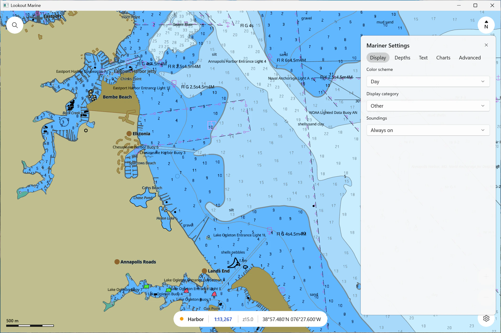

# Windows

A native **WinUI 3** shell (Windows App SDK, C++/WinRT) around the Zig chart
core. Same core, same C ABI and same behaviour as the other hosts.


The core renders with **Direct3D 12**, the Windows form of the Metal transport.
It owns the device, the pipelines (HLSL, compiled at run time) and a composition
swapchain. The shell attaches that swapchain to a `SwapChainPanel` with
`ISwapChainPanelNative::SetSwapChain`, and the XAML chrome floats over the
chart. On a machine with no GPU driver the core selects **WARP**, the in-box
software rasterizer, so the app still runs.

## Prerequisites

- **Windows 11**, **Visual Studio 2022** or later with the C++ workload, and the
  **Windows SDK 10.0.22621** or later.
- **Zig 0.16** on `PATH`.

NuGet restores `Microsoft.WindowsAppSDK` and `Microsoft.Windows.CppWinRT` at the
first build. tile57 is not a prerequisite.

## Build and run

```powershell
pwsh windows/build-core.ps1     # zig build lib -Dbackend=d3d12 -> ../zig-out
cd windows
msbuild LookoutMarine.vcxproj -t:Restore /p:Configuration=Release /p:Platform=ARM64
msbuild LookoutMarine.vcxproj /p:Configuration=Release /p:Platform=ARM64
.\ARM64\Release\LookoutMarine.exe
```

Use `/p:Platform=x64` on an x64 machine. The app is unpackaged and
self-contained: the build copies the Windows App SDK runtime next to the
executable.

## Dev hooks

| Variable | Effect |
|---|---|
| `LOOKOUT_OPEN` | Open this chart or folder at start |
| `LOOKOUT_VIEW` | `lon,lat,zoom[,rotation]` — the opening camera |
| `LOOKOUT_WARP` | `1` forces the software rasterizer |
| `LOOKOUT_OPEN_SETTINGS` | `1` opens the mariner pane at start, for a screenshot |



## Files

| File | Role |
|---|---|
| `ui/MainWindow.xaml` | The chrome: bubbles, readout capsule, scale bar, panes |
| `ui/MainWindow.xaml.cpp` | Window construction, chrome wiring, the render thread |
| `ui/MainWindow.Open.cpp` | The open flow, the layers flyout, the pickers, the chart panel |
| `ui/MainWindow.Input.cpp` | Gestures, commands, cursor pick, coordinate search |
| `ui/MainWindow.Hud.cpp` | The readout capsule and the scale bar |
| `ui/MainWindow.Settings.cpp` | The mariner pane: tabbed pages, applied on a debounce |
| `ui/winrt_glue.cpp` | Compiles the XAML-generated units that a command-line build does not register |
| `src/lk_controller.*` | The one `lookout*` handle and every `lookout_*` call |
| `src/lk_store.*` | Camera pose, recents and mariner settings in `%APPDATA%\lookout-marine\settings.ini` |
| `src/lk_format.*` | The readout formats: scale, band and position |

## Cautions

- **The chart is a child of the XAML tree.** Only a press that starts on the
  chart surface is a chart gesture. A press that starts on a control must stay
  with the control, or the button loses its click.
- **A command-line build does not register the XAML-generated units.**
  `winrt_glue.cpp` compiles them. Adding a XAML file means adding it there.
