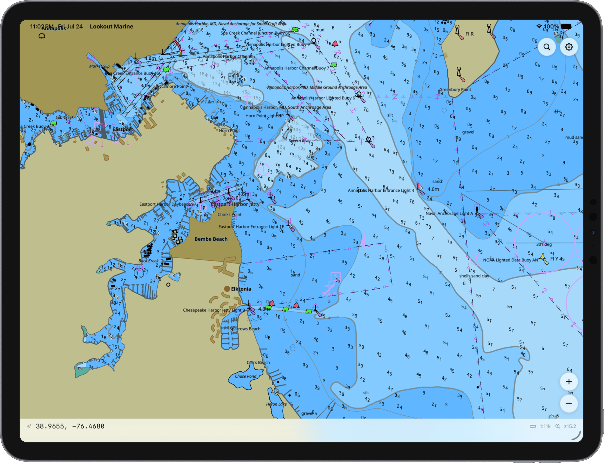

# Lookout Marine

A fast, native chartplotter for Mac, iPad, iPhone, Android and Linux. It draws
official ENC charts with the IHO portrayal rules, straight to the GPU with Metal or
Vulkan, and holds 60 fps.

:::warning Not for navigation
This is a prototype. It is not pixel-perfect and it makes no claim of ECDIS
conformance.
:::

| macOS · iPadOS · iOS | Linux |
|:---:|:---:|
|  |  |
| SwiftUI | GTK4 |

## These pages

- **[Architecture](architecture.md)** — the shared Zig core, the C ABI, the GPU
  backends, and how each native shell connects to them.
- **[The Linux host (GTK4)](hosts-linux.md)** — the GTK4 shell in detail. It shows
  how the host composites the chart to make the chrome float above it. It also
  describes the two designs that failed.
- **[Screenshot protocol](screenshots.md)** — the chart, the camera, and the window
  size that each host must use. You can then compare the hosts frame by frame.

`macos/README.md` and `android/README.md` in the repository describe the Apple host
and the Android host. The chart engine has its own documentation at
[tile57](https://github.com/beetlebugorg/tile57).

To learn why the project has this structure — one core and several native shells
written by AI — refer to
[the README](https://github.com/beetlebugorg/lookout-marine#how-we-use-ai).
