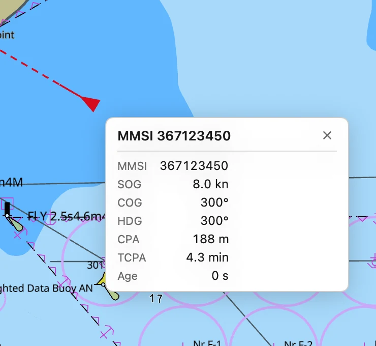
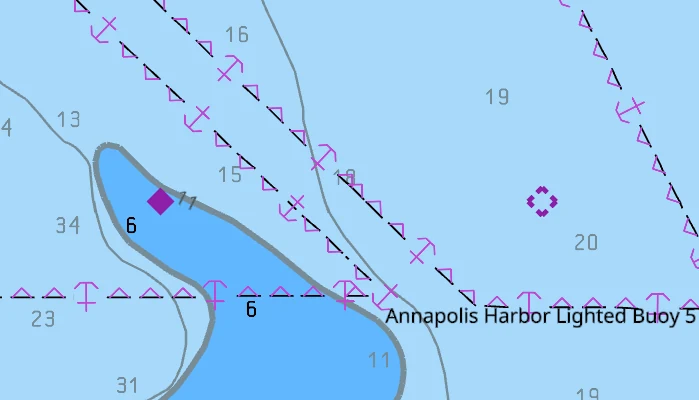
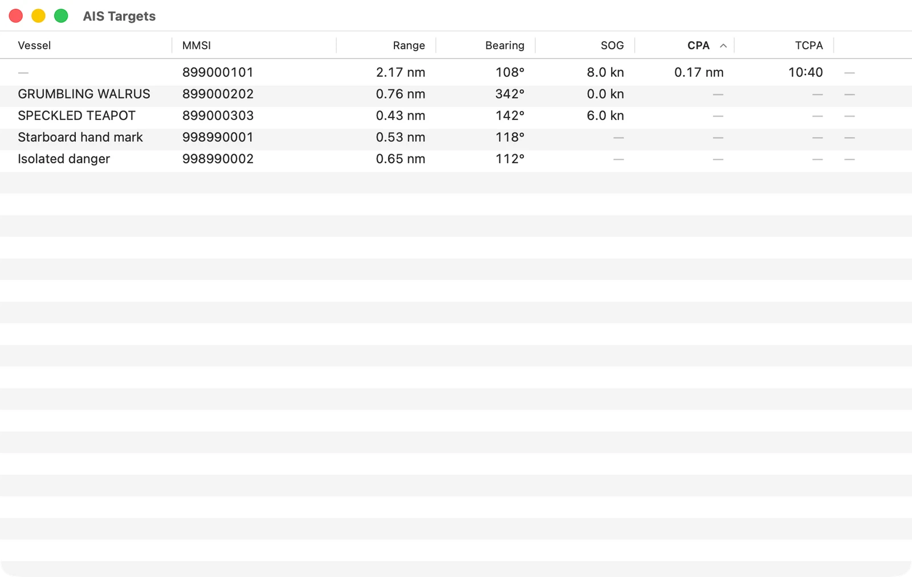
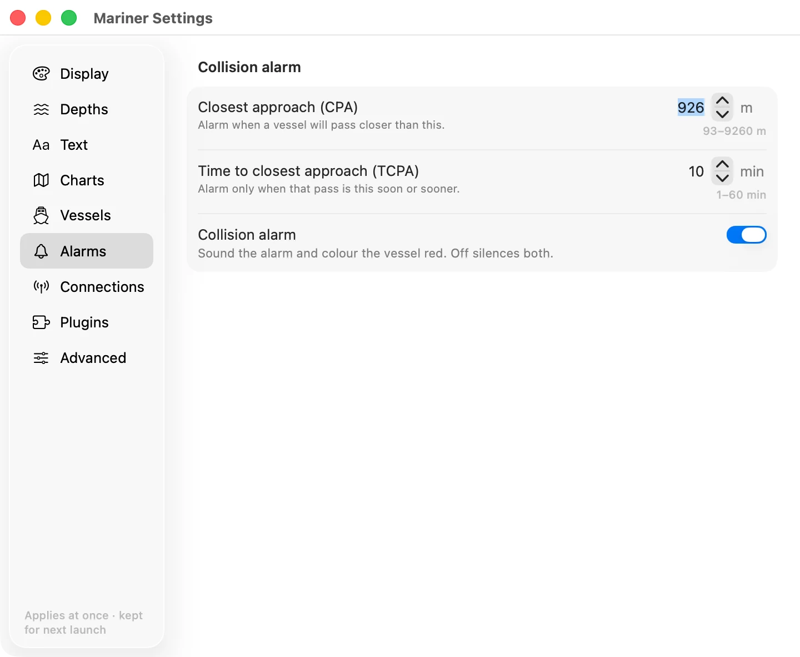
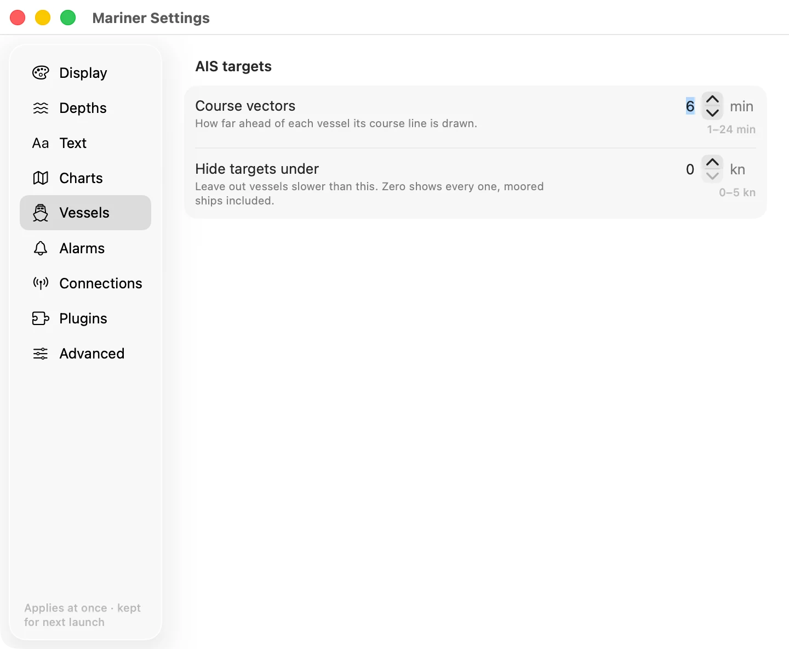

# AIS traffic

Every AIS target your receiver hears draws on the chart, and any vessel that
will pass close raises an alarm. All of it needs a
[connection](instrument-connections.md) that carries AIS.

## Reading the target symbols

A vessel is a magenta triangle, pointing where it is heading. A target that
reports no heading is pointed along its course over ground instead, and one
that reports neither is left pointing north.

Two lines run out of the triangle, the same pair
[your own boat flies](your-boat.md#reading-the-boat-the-heading-line-and-the-course-line).

- **The heading line** is solid and short. It is where the vessel's bow points.
  A target that has not reported a heading flies no heading line.
- **The course vector** is dashed and reaches as far as the vessel will travel
  in the time you set. A vessel under about 0.4 knots flies no vector, so a
  ship at anchor is a bare triangle.

## Reading a target's details

Rest the pointer on a target and a card appears beside it. Click, or tap on a
touch screen, and the card stays up with a close button on it. One card is up at
a time, and a click on open water closes it.

The card gives the vessel's name, or its MMSI when it has broadcast no name,
and then:

| Row | What it is |
|---|---|
| MMSI | The vessel's number. |
| SOG | Speed over ground, in knots. |
| COG | Course over ground, degrees true. |
| HDG | Heading, degrees true. Absent when the vessel reports none. |
| CPA | How close it will pass. |
| TCPA | How long until that pass. |
| Age | How long since its last report. |

CPA and TCPA are worked out from your position and course against the target's,
so they appear only when your own boat has a fix, and only while the target is
still closing. A vessel already past its nearest point shows neither.

## Reading the aids to navigation

An aid to navigation broadcasts its own position, and draws as a diamond rather
than a triangle.

- **A filled diamond** is a real mark: a buoy or a beacon with a transmitter on
  it.
- **A broken diamond** is a virtual mark. A shore station is broadcasting the
  aid and there is nothing in the water. Do not expect to sight anything there,
  by day or by night.

An aid flies no heading line and no vector, and never has a CPA. Its card gives
the MMSI, the kind of mark, whether it is virtual, and whether it says it is on
station.

An aid that reports itself **off position** draws amber instead of magenta, and
its row in the AIS Targets list goes amber too. The mark has moved off the
position the chart gives it. Do not take a fix from it until you can see where
it now is.

## Listing the targets in a table

**Vessels ▸ AIS Targets…** in the menu bar opens the list of everything on the
chart right now. It refreshes once a second.

The columns are the vessel's name, its MMSI, its range and bearing from you, its
speed, and its closest approach with the time to it. Range under a tenth of a
mile is given in metres.

A dash is a value the app has never heard. An aid to navigation carries dashes
for speed and for both approach columns, and a vessel that has broadcast no name
carries one where its name would be.

The list opens sorted by closest approach, nearest pass first. Click a heading
to sort by that column instead, and click it again to reverse it.

A vessel in the collision alarm holds the top of the list whatever you sort by.
Its row is red and its last column reads **ALARM**. An aid that says it is off
position takes an amber row, and stays in the sort with everything else.

Double-click a row, or select it and press Return, to put that target in the
middle of the chart with its card pinned. If the chart was locked to your own
boat, the lock drops, so the chart stays on the target you asked for.

## Setting the collision alarm

Every vessel on the chart is run against your own boat once a second, for how
close it will pass and how long until it does. The two limits that decide what
is close enough and soon enough are in **Settings ▸ Alarms**.

- **Closest approach (CPA).** Alarm when a vessel will pass closer than this.
  It starts at 926 m, which is half a nautical mile, and takes anything from
  93 m to 9260 m.
- **Time to closest approach (TCPA).** Alarm only when that pass is this soon.
  It starts at 10 minutes, and takes 1 to 60.
- **Collision alarm.** Off silences the alarm and the red colour with it.

A target has to fail both limits at once. A ship that will pass fifty metres off
an hour from now is not an alarm. Neither is one passing a mile away in two
minutes. A vessel already past its closest point never alarms, however close it
came.

The alarm fires once, as the target crosses into the limits. It does not fire
again until that target has left them and come back.

:::warning What the alarm does today
The alarm makes no sound, and it puts no banner on the screen. What you get is
the target turning red on the chart and its row going red at the top of the AIS
Targets list. Do not leave the screen and expect to be called.
:::

Without a position of your own there is no approach to work out. The traffic
still draws, and nothing is ever flagged.

## Setting how far the course vectors reach

**Course vectors**, in **Settings ▸ Vessels**, is how many minutes ahead each
vessel's dashed line is drawn. Six minutes is the start, and it takes 1 to 24. A
longer vector shows which ships are converging on you. A shorter one keeps a
crowded harbour readable. It changes the vessels' lines only, not your own
boat's.

## Hiding the targets that are not moving

**Hide targets under**, in the same **Vessels** section, leaves out any vessel
slower than the speed you give. It starts at zero, which shows everything,
moored ships included, and takes up to 5 knots.

A limit of half a knot leaves out moored and anchored vessels and keeps the ones
under way. Aids to navigation are never hidden by it.

## Ageing out a target that has stopped reporting

A vessel that has not been heard for three minutes comes off the chart and out
of the list. It comes back the moment it reports again.

An aid to navigation transmits about every three minutes, so the same rule would
take a mark off that is sitting exactly where it should be. An aid is given ten
minutes instead.
