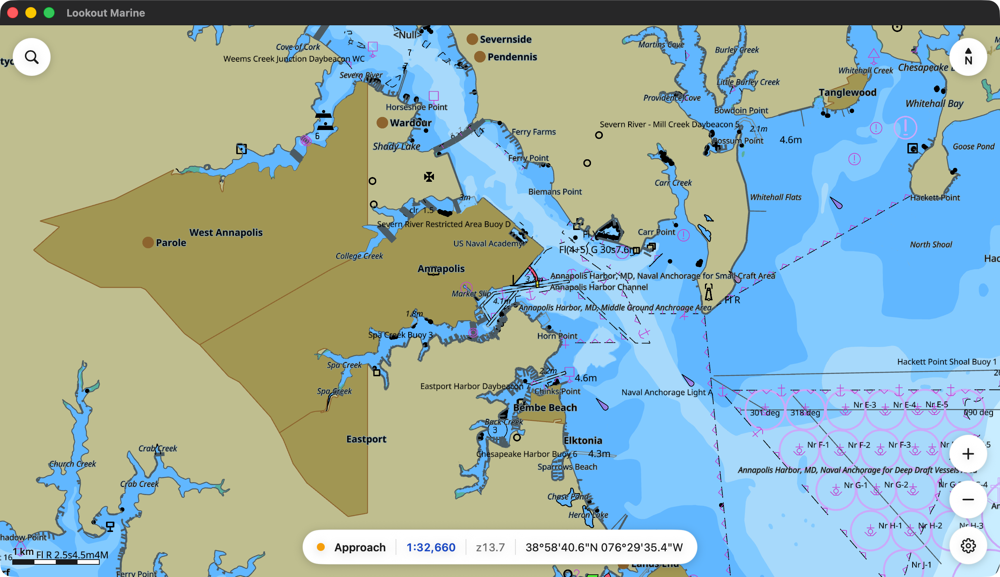
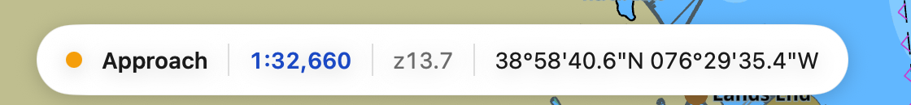
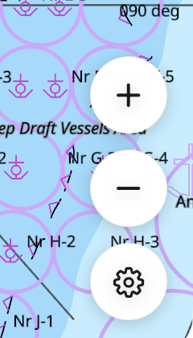
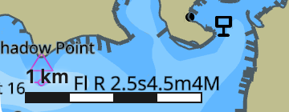

# Chart window

The chart fills the window and the controls float in the corners. Everything
between them is chart: a drag there pans, even close to a button.

## Readout capsule

- **Band** — the kind of chart you are on: Berthing, Harbor, Approach, Coastal,
  General or Overview.
- **Scale**, in blue — click it to [go to a scale](moving-the-chart.md#go-to-a-scale).
- **Zoom** — how far in you are. It is finer than the scale, and it is the quick
  way to return to the same view twice.
- **Position** — under the pointer while you hover, otherwise the centre of the
  view. A touch screen has nothing to hover with, so a tablet and a phone always
  state the centre.
- **Overscale**, in amber — the chart is magnified past its survey. `×1.4` means
  you are looking 1.4 times closer than the data supports. What you see is
  larger, not more accurate.

A phone hides the band and sets the type smaller. Position and scale always stay.

## Bubbles

- **Search**, top left — go to a position.
- **North**, top right — it points north as you turn the chart. Click it to
  square the chart up again.
- **Plus and minus**, bottom right — one zoom step about the centre.
- **Gear**, bottom right — [mariner settings](mariner-settings.md).

## Scale bar

A round distance at the current scale, in the bottom left corner.

## Pick report

Click or tap a feature. The report lists each object under the cursor and the
chart cell it came from.

## Starting up

The first start prepares the chart symbols and takes a few seconds. Later starts
skip that work. While a library opens, the app states what it is doing.

When you pan into new water, a small pill appears at the top. The chart stays
live while the new area fills in.
