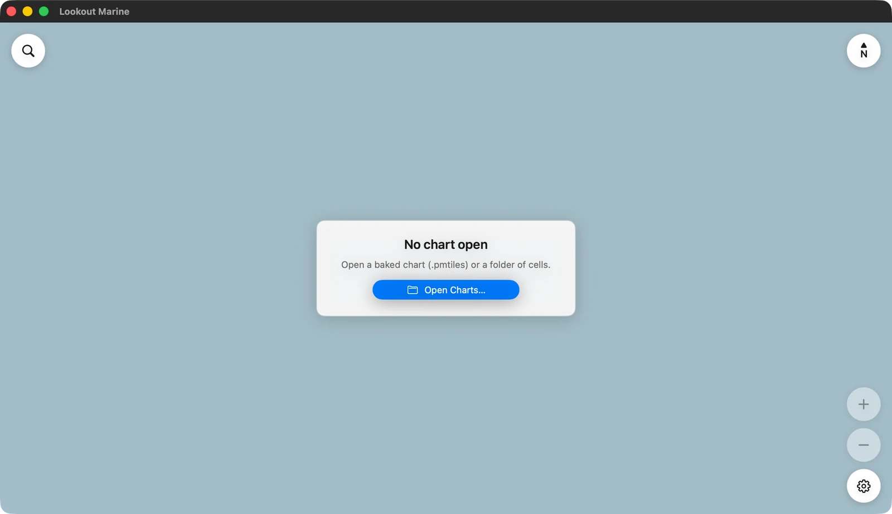

# Getting started

:::warning Not for navigation
This is a prototype. Keep your official charts and your paper backup.
:::

## Building the app from source

There are no downloads yet: no App Store build, no installer, no release
binary. Today you build the app yourself. When releases exist, this section
becomes download links.

**macOS is the proven platform.** You need Xcode, free from the Mac App Store,
and two command-line tools, from [Homebrew](https://brew.sh):

```sh
brew install zig xcodegen
```

Then clone the repository and build the Mac app:

```sh
git clone https://github.com/beetlebugorg/lookout-marine.git
cd lookout-marine/macos && xcodegen generate && cd ..
apple/build.sh mac Release
open apple/build/Build/Products/Release/LookoutMarine.app
```

The first build compiles the chart engine as well as the app, so give it a few
minutes. After that, the last two commands are the whole rebuild.

On another platform, follow the developer guide instead. It carries the same
short recipe for [Linux](../developer-guide/linux.md#building-and-running),
[Windows](../developer-guide/windows.md#building-and-running),
[Android](../developer-guide/android.md#building-and-running) and
[iPhone and iPad](../developer-guide/macos.md#building-and-running).

## Getting your charts

The app does not come with charts. NOAA publishes the ENC cells of United States
waters at no cost: download the whole set, or the cells of your area, from the
[NOAA chart downloader](https://charts.noaa.gov/InteractiveCatalog/nrnc.shtml).
Each cell is a file such as `US5MD1MC.000`.

Most other hydrographic offices sell their ENCs, and most sell them encrypted
with S-63, which the app cannot read yet. Any unencrypted S-57 cell works,
whoever published it.

Prepare them one time with the tile57 tool. It is a separate program: clone
[tile57](https://github.com/beetlebugorg/tile57) and run `zig build`, which
writes `zig-out/bin/tile57`.

```sh
tile57 bake CELL.000 -o out/      # one cell
tile57 bake ENC_ROOT -o out/      # every cell you downloaded
```

You now have a folder of `.pmtiles` charts.

## Opening a chart folder

Open the folder, not the single cells. The app then draws the most detailed
chart available at each point and stitches the seams, the way a chart table
works: the harbour chart where you have one, the coastal chart around it.

- **Mac**: **File ▸ Open Chart…** (⌘O).
- **Windows and Linux**: **Open**, or Ctrl+O.
- **iPad and iPhone**: the gear, then **Charts ▸ Add Charts…**. You can also
  drop the folder into the app with Files or the Finder.
- **Android**: the **Charts** tab of the settings.

With nothing open yet, the same picker sits in the middle of the window:



The app opens where you left it the last time.

## Finding your water

A whole coast is a lot of chart. Two quick ways in:

- Type a position in the search field, at the top left. `38.978, -76.492` and
  `38°58'40"N 076°29'32"W` both work, latitude first.
- Click the blue scale in the bar at the bottom and pick **Harbor**.

Next: [what everything on the screen means](chart-window.md), and
[how to move the chart](moving-the-chart.md).
