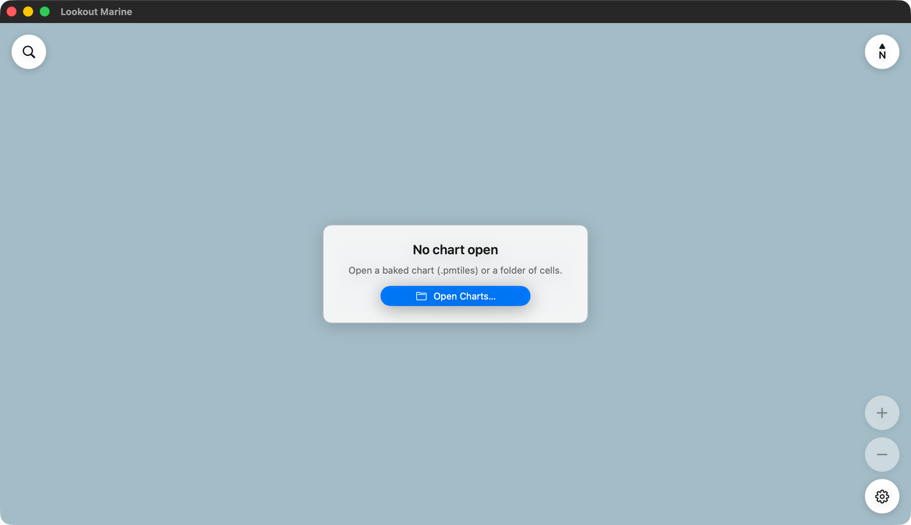

# Getting started

:::warning Not for navigation
This is a prototype. Keep your official charts and your paper backup.
:::



## Get your charts

The app does not come with charts. Hydrographic offices give the cells away at
no cost. In the United States, download the ENC set, or the cells of your area,
from the [NOAA chart downloader](https://charts.noaa.gov/InteractiveCatalog/nrnc.shtml).
Each cell is a file such as `US5MD1MC.000`.

Prepare them one time with the tile57 tool:

```sh
tile57 bake CELL.000 -o out/      # one cell
tile57 bake ENC_ROOT -o out/      # every cell you downloaded
```

You now have a folder of `.pmtiles` charts.

## Open them

Open the folder, not the single cells. The app then draws the most detailed
chart available at each point and stitches the seams, the way a chart table
works: the harbour chart where you have one, the coastal chart around it.

- **Mac**: **File ▸ Open Chart…** (⌘O).
- **Windows and Linux**: **Open**, or Ctrl+O.
- **iPad and iPhone**: the gear, then **Charts ▸ Add Charts…**. You can also
  drop the folder into the app with Files or the Finder.
- **Android**: the **Charts** tab of the settings.

The app opens where you left it the last time.

## Find your water

A whole coast is a lot of chart. Two quick ways in:

- Type a position in the search field, at the top left. `38.978, -76.492` and
  `38°58'40"N 076°29'32"W` both work, latitude first.
- Click the blue scale in the bar at the bottom and pick **Harbor**.

Next: [what everything on the screen means](chart-window.md), and
[how to move the chart](moving-the-chart.md).
