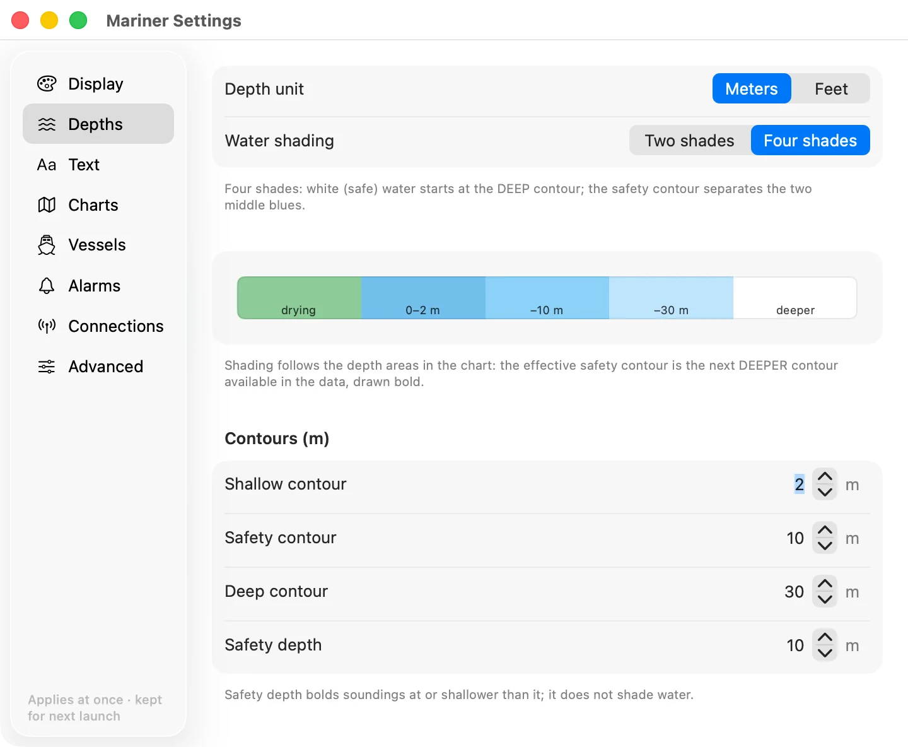
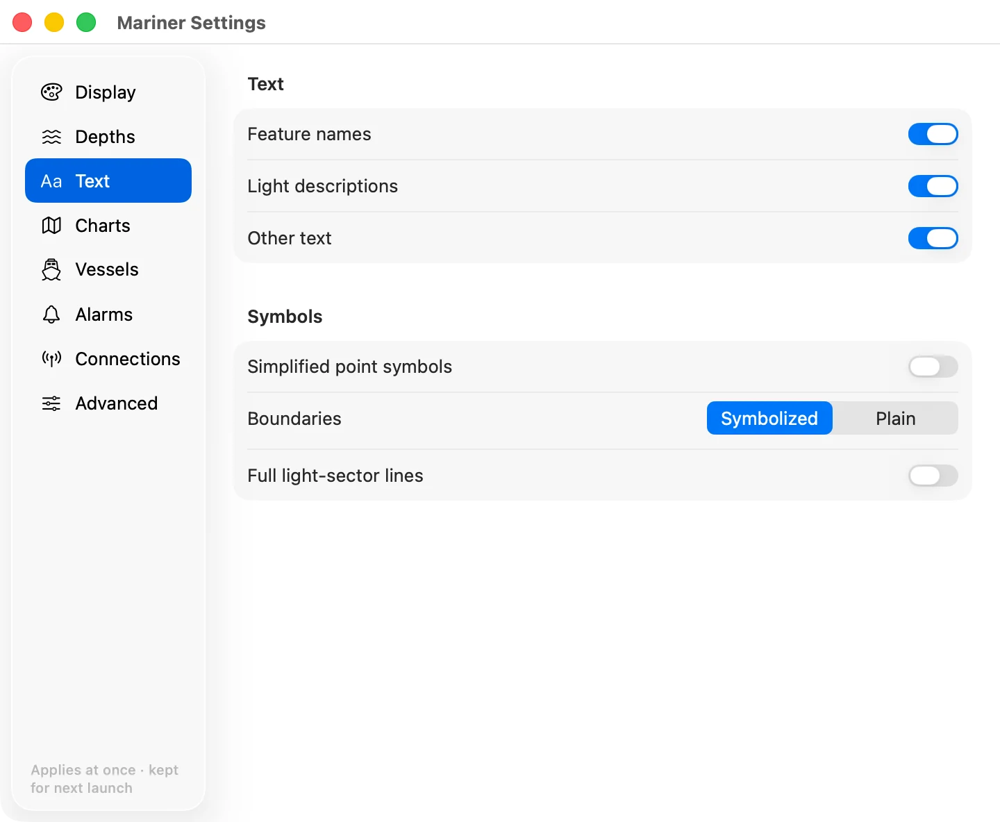
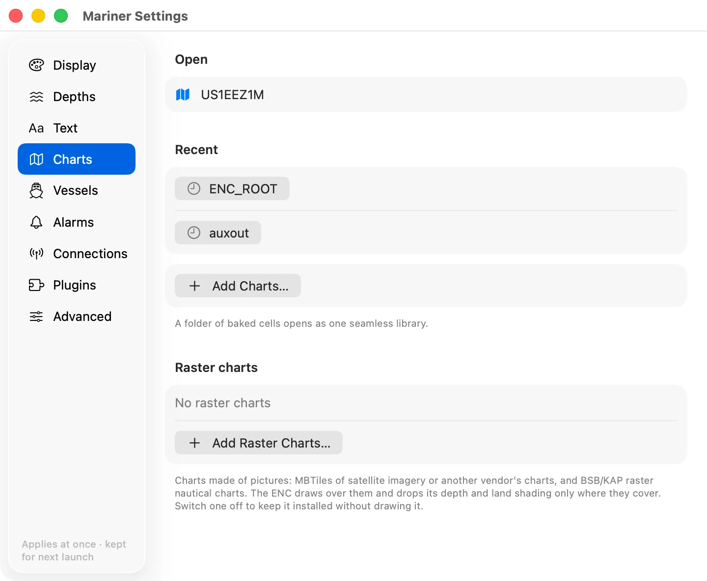
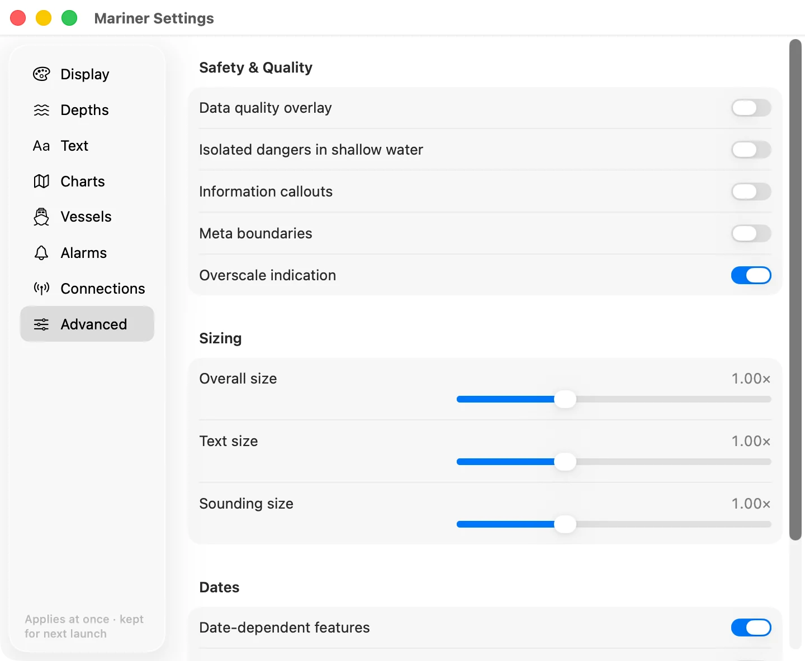

import AnnotatedShot from '@site/src/components/AnnotatedShot';
import settingsDisplay from '../img/settings-display.webp';

# Mariner settings

The gear opens the settings. ⌘, (Ctrl+,) does the same. Every change applies to
the chart at once and is kept for the next time.

## Choosing the colour scheme and detail

<AnnotatedShot
  src={settingsDisplay}
  alt="The Display section of mariner settings on macOS"
  caption="The Display section on macOS. Markers use the S-52 mariner magenta, the same colour the app uses for a pick."
  marks={[
    {n: 1, x: 10.8, y: 56.1},
    {n: 2, x: 20.8, y: 22.1, lead: 2.5},
    {n: 3, x: 20.8, y: 60.3, lead: 2.5},
    {n: 4, x: 20.8, y: 85.3, lead: 2.5},
  ]}
  legend={[
    {n: 1, term: 'Sections.', body: 'Display, Depths, Text, Charts, Vessels, Alarms, Connections and Advanced. Vessels, Alarms and Connections appear only while a plugin fills them.'},
    {n: 2, term: 'Colour scheme.', body: 'Day, dusk and night palettes switch instantly. The chrome follows the chart, not the OS, so at night the settings window is dark too.'},
    {n: 3, term: 'Display category.', body: 'How much of the chart is drawn. Base ⊂ Standard ⊂ Other.'},
    {n: 4, term: 'Soundings.', body: 'Spot soundings switch independently of the category.'},
  ]}
/>

**Colour scheme.** Day, dusk or night. Night dims the whole palette for a dark
wheelhouse. ⌘L steps through the three.

**Display category.** How much the chart shows.

- **Base** is the minimum an ECDIS may never hide: the coastline, the safety
  contour, dangers, traffic separation.
- **Standard** adds what you steer by day to day: buoys, beacons, lights,
  restricted areas, ferry routes.
- **Other** adds the rest: spot soundings, contour labels, seabed quality,
  submarine cables and the like.

Each category contains the one before it. ⌘D switches between Standard and
Other.

**Soundings.** Spot depths, on or off, whatever the category. ⌘⇧S.

## Setting the safety contour and depth shading

**Depth unit.** Metres, feet or fathoms. It changes the numbers you type below,
and the soundings.

**Water shading.** Two shades or four.

- **Two shades**: everything deeper than your safety contour is white, and
  everything shallower is blue.
- **Four shades**: very shallow, shallow, deep and very deep get their own tint,
  which reads better in pilotage water.

**Safety contour.** The depth your boat needs. Water shallower than it is shaded
as unsafe, and the contour itself is drawn bold.

The chart can only draw the contours it holds, usually 2, 5, 10, 20 and 30
metres. If you ask for 7 m, the app uses the next **deeper** contour in the
data, which is 10 m. That is the conservative choice and it is what an ECDIS
does. The bold line on the chart is the contour actually in use, not the number
you typed.

**Shallow and deep contours.** Where the four-shade tints change. They do not
affect the safety contour.

**Safety depth.** Soundings at or shallower than this print bold. It changes
only the sounding numbers, not the water shading.

## Choosing what text and symbols appear

Feature names, light descriptions and other text can each be switched off when
the chart gets busy. ⌘T switches all text.

**Simplified point symbols.** The paper-chart buoy shapes, or the simplified
ECDIS ones.

**Boundaries.** Plain or symbolised area limits.

**Full light-sector lines.** Draw each sector out to its full range, instead of
a short leader. It is useful on approach and noisy in a crowded harbour.

## Managing your chart library

The open library, the recent ones, and the button to add more.

## Adding a connection

Where the boat's data comes from. You need none of this to read a chart. A
connection is what puts your boat and the traffic around you on it.

Two pages carry this in full: [instrument
connections](instrument-connections.md) and [Signal K
servers](signal-k-servers.md).

There are two kinds of source and a section for each. A boat can have both, and
more than one of either.

**Connections.** NMEA 0183 over TCP, which is what almost every WiFi
instrument gateway serves. Give it the gateway's address and port; most of them
use port 10110.

**Signal K servers.** A Signal K server on the boat. Signal K is an open
marine data standard: the server reads every instrument it can reach and streams
the readings in one format. Give it the server's address and port. The stream is
usually on port 8375. Port 3000 is the server's own web page, which is not the
stream.

Under each row is what that source is doing right now: connected and how fast
data is arriving, paused, or unreachable. The switch on the right pauses a
source without deleting it: the connection closes and stays closed until you
switch it back on. Open a row with the chevron to change its address.

Everything switched on here feeds the same chart. When two sources carry the
same reading (a Signal K server and a NMEA gateway both reporting heading), the
chart uses one of them and falls back to the other if the first goes quiet for
five seconds. You cannot yet choose which one wins.

## Changing the Advanced settings

**Data quality overlay.** The zones of confidence, so you can see which surveys
are old or sparse.

**Isolated dangers in shallow water.** Show the isolated danger symbol inside
water already shaded unsafe. S-52 allows both; some mariners want the reminder.

**Information callouts** and **meta boundaries** show the notes and the data
limits carried in the cell.

**Overscale indication.** The amber badge when you magnify past the survey.

**Sizing.** Symbol, text and sounding size. Raise it for a wheelhouse screen
you read from two paces back.

**Dates.** Charts carry features that only apply between two dates, such as a
seasonal buoy. Set a view date to see the chart as it will be then. Leave it
empty for today, and switch **highlight** on to see which features are
date-dependent.
