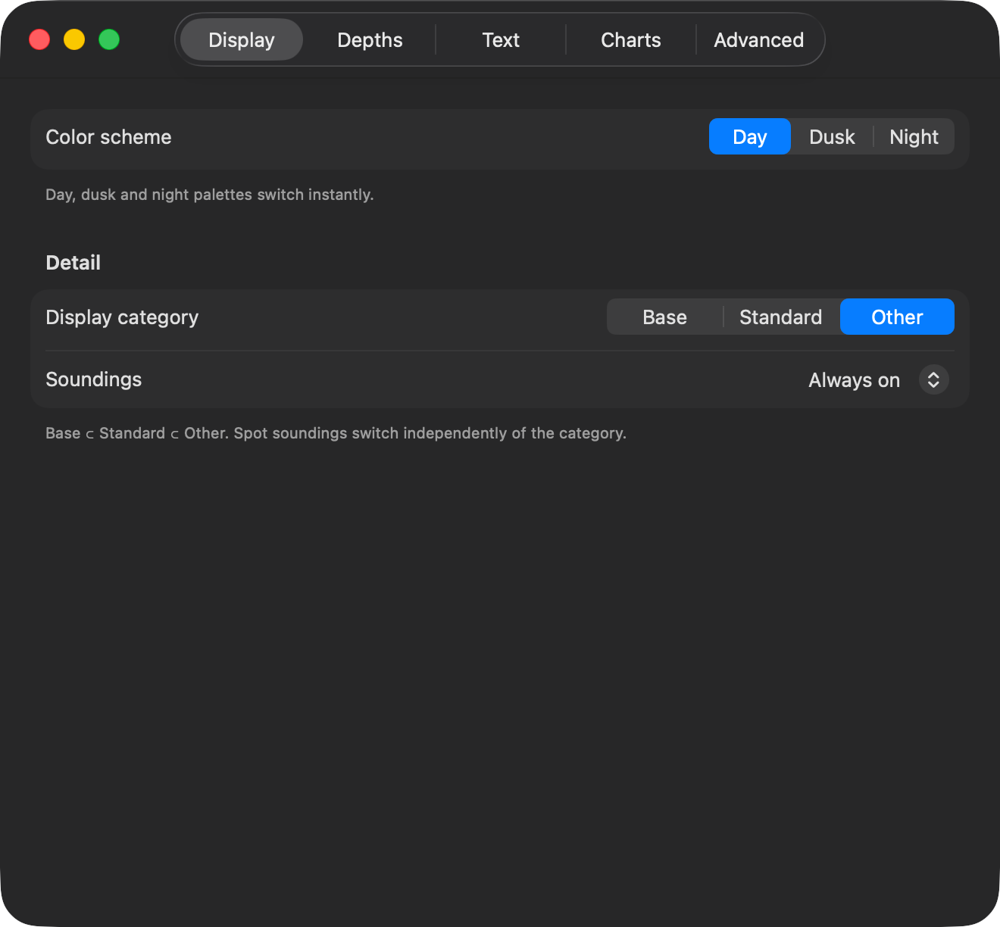
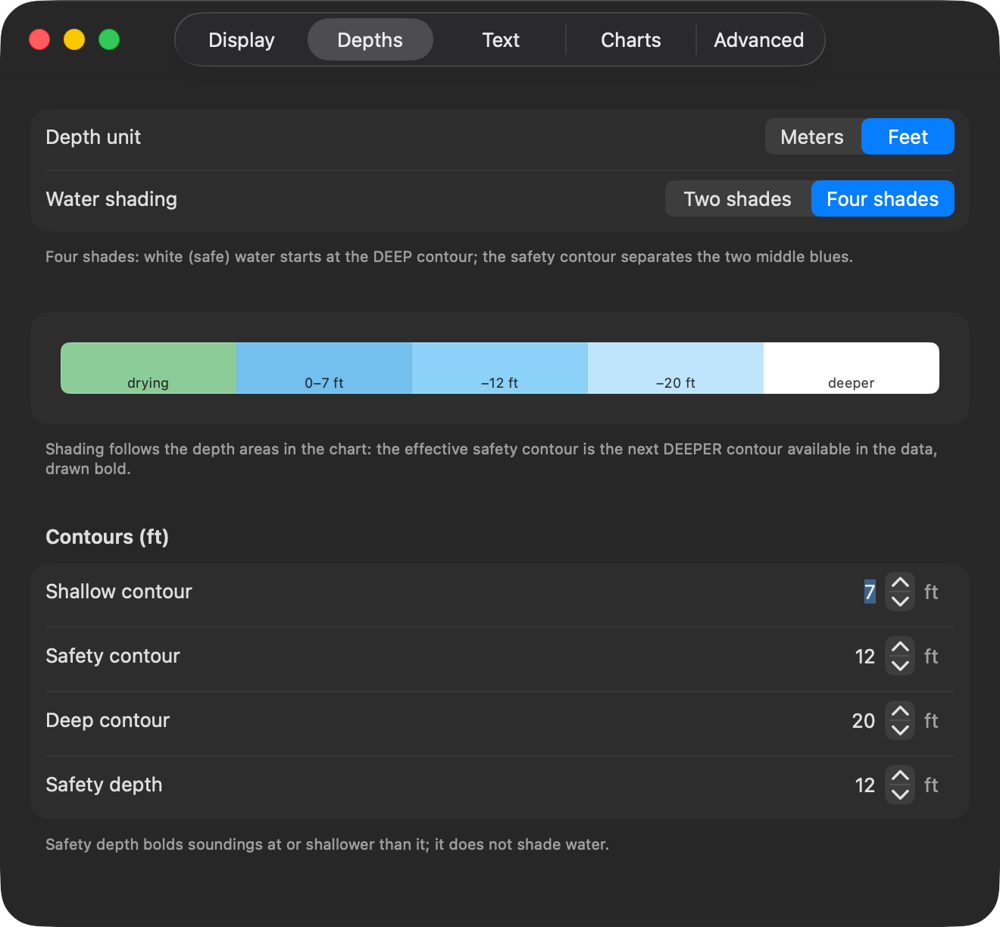
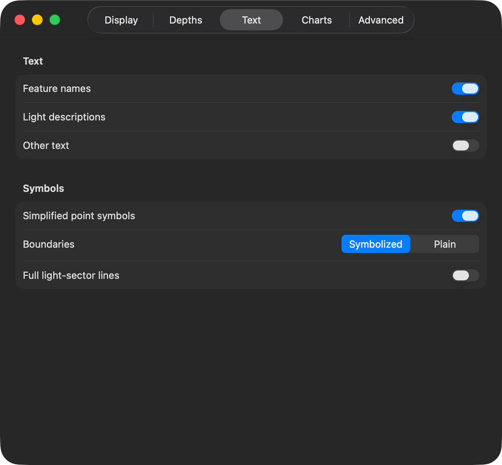
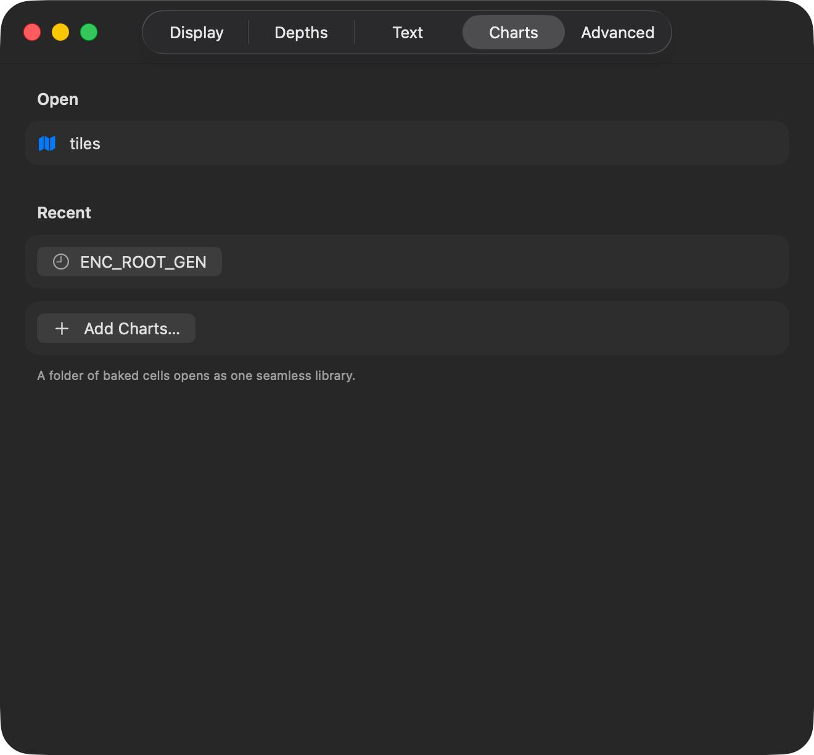
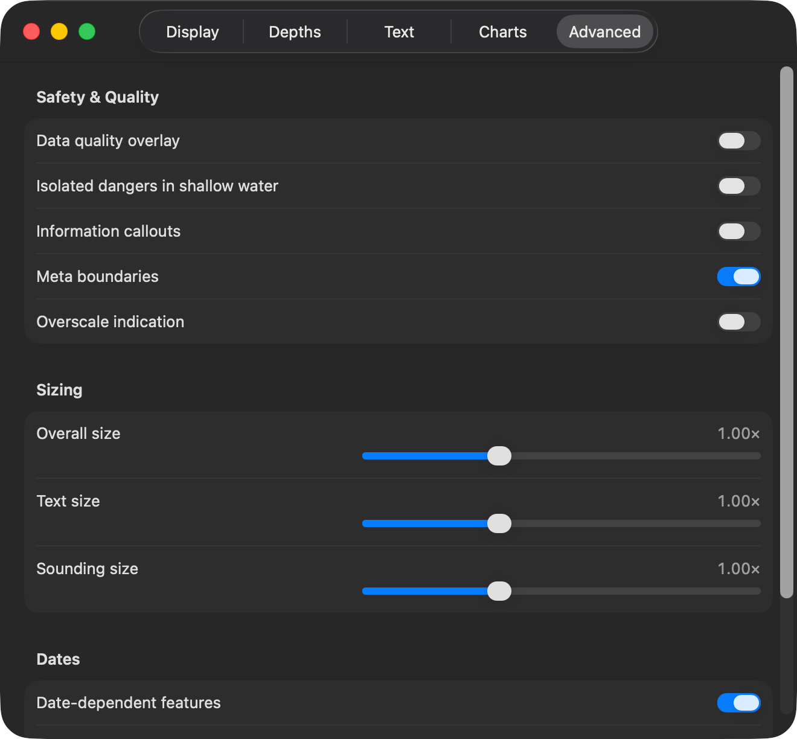

# Mariner settings

The gear opens the settings. ⌘, (Ctrl+,) does the same. Every change applies to
the chart at once and is kept for the next time.

## Display

**Colour scheme** — day, dusk or night. Night dims the whole palette for a dark
wheelhouse. ⌘L steps through the three.

**Display category** — how much the chart shows.

- **Base** is the minimum an ECDIS may never hide: the coastline, the safety
  contour, dangers, traffic separation.
- **Standard** adds what you steer by day to day: buoys, beacons, lights,
  restricted areas, ferry routes.
- **Other** adds the rest: spot soundings, contour labels, seabed quality,
  submarine cables and the like.

Each category contains the one before it. ⌘D switches between Standard and
Other.

**Soundings** — spot depths, on or off, whatever the category. ⌘⇧S.

## Depths

**Depth unit** — metres, feet or fathoms. It changes the numbers you type below,
and the soundings.

**Water shading** — two shades or four.

- **Two shades**: everything deeper than your safety contour is white, and
  everything shallower is blue.
- **Four shades**: very shallow, shallow, deep and very deep get their own tint,
  which reads better in pilotage water.

**Safety contour** — your keel line. Water shallower than it is shaded as
unsafe, and the contour itself is drawn bold.

The chart can only draw the contours it holds, usually 2, 5, 10, 20 and 30
metres. If you ask for 7 m, the app uses the next **deeper** contour in the
data, which is 10 m. That is the conservative choice and it is what an ECDIS
does. The bold line on the chart is the contour actually in use, not the number
you typed.

**Shallow and deep contours** — where the four-shade tints change. They do not
affect the safety contour.

**Safety depth** — soundings at or shallower than this print bold. It shades no
water; it only marks the numbers.

## Text

Feature names, light descriptions and other text can each be switched off when
the chart gets busy. ⌘T switches all text.

**Simplified point symbols** — the paper-chart buoy shapes, or the simplified
ECDIS ones.

**Boundaries** — plain or symbolised area limits.

**Full light-sector lines** — draw each sector out to its full range, instead of
a short leader. Useful on approach, noisy in a crowded harbour.

## Charts

The open library, the recent ones, and the button to add more.

## Advanced

**Data quality overlay** — the zones of confidence, so you can see which surveys
are old or sparse.

**Isolated dangers in shallow water** — show the isolated danger symbol inside
water already shaded unsafe. S-52 allows both; some mariners want the reminder.

**Information callouts** and **meta boundaries** — the notes and the data limits
carried in the cell.

**Overscale indication** — the amber badge when you magnify past the survey.

**Sizing** — symbol, text and sounding size. Raise it for a wheelhouse screen
you read from two paces back.

**Dates** — charts carry features that only apply between two dates, such as a
seasonal buoy. Set a view date to see the chart as it will be then. Leave it
empty for today, and switch **highlight** on to see which features are
date-dependent.
