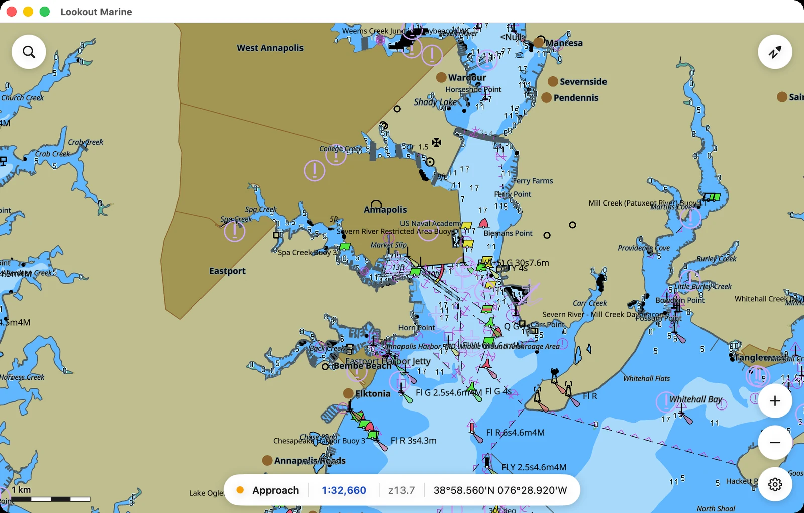
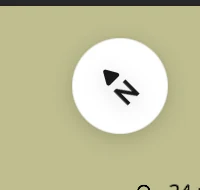
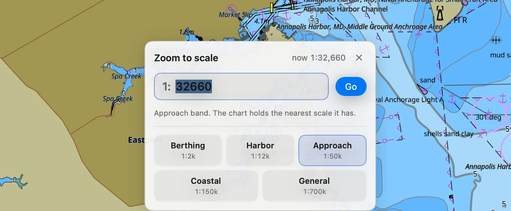
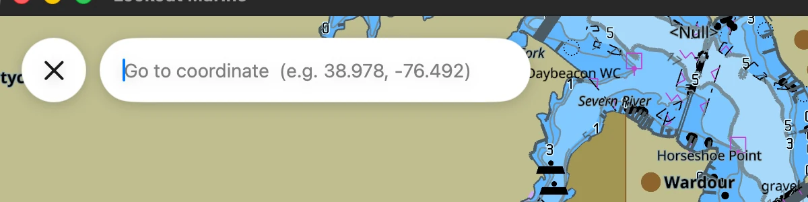

# Moving the chart

## Turning the chart, and squaring it up

Shift + drag with a mouse, or twist two fingers on a touch screen. The chart
turns about the centre of the view.

The north bubble in the top right corner points north the whole time. Press ⌘↑
(Ctrl+↑) and the chart returns to north-up.

Clicking or tapping the bubble does something else: it locks the chart to your
boat. See [holding the boat on the
screen](your-boat.md#holding-the-boat-on-the-screen).

On a touch screen the twist waits until you have turned about 18 degrees. Two
fingers never pinch without some twist, and without the pause every zoom would
also spin the chart.

## Going to a scale

Click the blue scale in the bar at the bottom.

- Type a scale and press Return. `25000`, `25,000`, `1:25000` and `25k` all mean
  the same thing.
- Or pick a band: Berthing, Harbor, Approach, Coastal, General. The band you are
  in is marked.

If you ask for more than the survey holds, the chart stops at the closest scale
it has.

## Searching for a position

The search bubble is in the top left corner. Type a position and press Return.
Latitude first:

- `38.978, -76.492`
- `38°58'40"N 076°29'32"W`, or `38 58 40 N, 76 29 32 W`

The zoom and the rotation stay as they are. Search by place name is not
available yet.

## Keyboard shortcuts

Mac uses Command. Windows and Linux use Control.

| Key | Action |
|---|---|
| ⌘O | Open a chart or a folder |
| ⌘+ and ⌘− | Zoom in and out |
| ⌘0 | Fit the whole chart |
| ⌘↑ | North-up |
| ⌘L | Next colour scheme: day, dusk, night |
| ⌘T | Text on or off |
| ⌘⇧S | Soundings on or off |
| ⌘D | Full detail on or off |
| ⌘, | Mariner settings |
| Ctrl+F | Search (Windows and Linux) |

## Mouse and trackpad gestures

| Action | Result |
|---|---|
| Drag | Pan. Throw it and the chart coasts to a stop. |
| **Shift + drag** | Turn the chart about the centre. It follows the drag. |
| Wheel, or two-finger scroll | Zoom at the pointer. |
| Pinch on a trackpad | Zoom at the pointer. |
| Click | Pick report for what is under the cursor. |
| Double-click (Windows) | Zoom in at the pointer. |

## Touch gestures

| Action | Result |
|---|---|
| Drag one finger | Pan. Throw it and the chart coasts to a stop. |
| Pinch | Zoom between the fingers. |
| Twist two fingers | Turn the chart. |
| Tap | Pick report for what is under your finger. |
| Double tap | Zoom in. |
| Two finger tap (iPad and iPhone) | Zoom out. |
