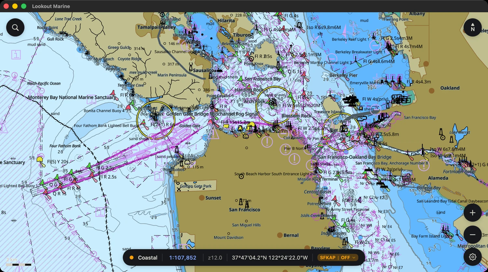
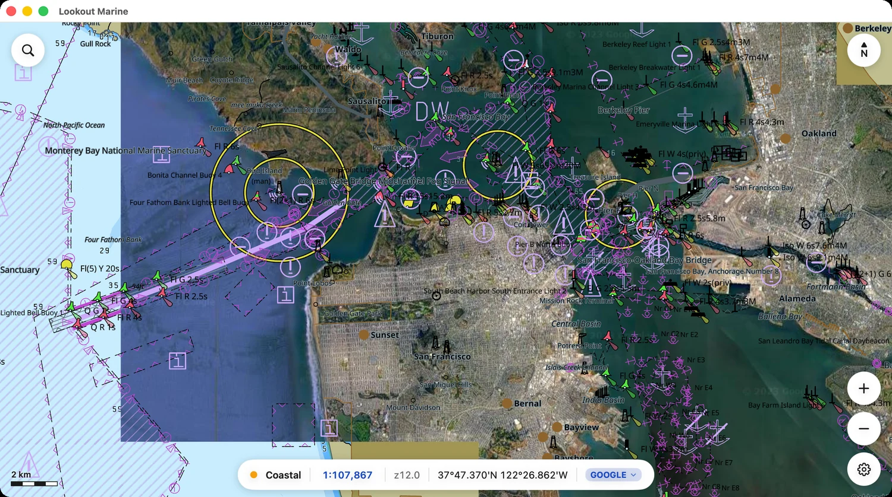
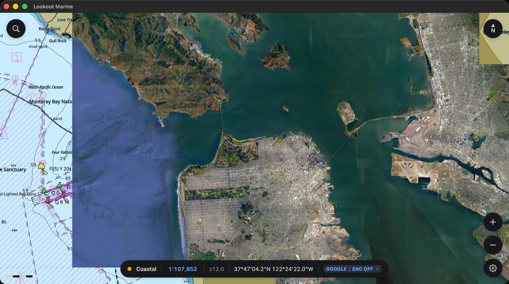
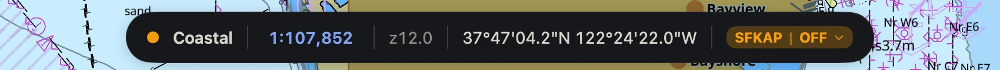
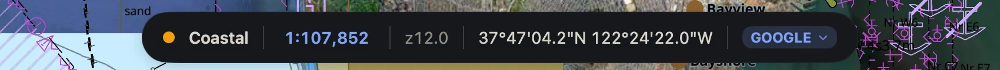
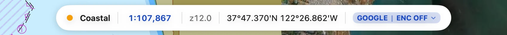
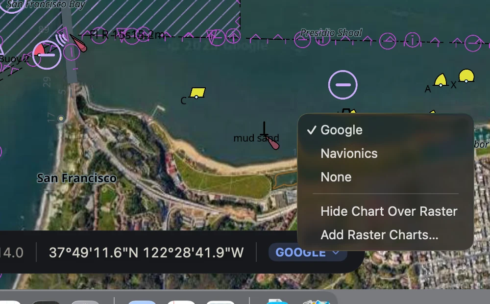
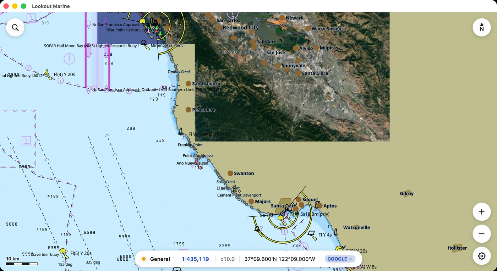

# Raster charts

A **raster chart** is a chart made of pictures rather than features. Lookout
reads two kinds:

- **MBTiles** — satellite imagery, or another vendor's chart rendered to tiles.
  Cruisers publish these for coasts the ENC covers poorly.
- **BSB/KAP** — raster nautical charts, such as the discontinued NOAA RNC
  sheets, baked with tile57.

The ENC tells you the depths, the aids and the hazards. It cannot tell you what
is there now: the coral heads, the sand bar across the entrance, the breakwater
built since the last edition. A raster chart can.

Lookout draws a raster chart below the ENC and drops the ENC's own shading only
where the raster chart covers. You keep the chart, and you see the water.

## Three views of the same water

The Golden Gate, at the same camera, in each of the three states.

**The ENC alone.** Depth shading, aids, hazards — and no picture of what is
there.

**The raster chart below the ENC.** The ENC drops its depth and land shading
where the raster chart covers, and keeps everything else: the contours, the
buoys, the lights, the traffic separation, the soundings and the labels.

**The raster chart alone.** ⇧⌘H hides the ENC where the raster chart covers it.

## Add a raster chart

Raster charts are yours to supply. Lookout has no catalogue and downloads
nothing.

Open **Chart ▸ Add Raster Charts…** (⇧⌘I), or the **Raster charts** section of
the Charts tab in Settings. The panel takes several files at once, and whole
folders.

Lookout adds the list again to every chart you open, so a raster chart survives
a change of ENC and a restart.

To switch one off without removing it, use the **Raster charts** section of the
Charts tab in Settings. These are half-gigabyte downloads; carrying four
providers for one coast usually means wanting three of them quiet.

## Sets

MBTiles files group into **sets** by their provider. Files named `…ArcGIS…`,
`…Bing…` and `…Google…` become three sets. Files from one provider that cover
adjacent regions become one set, and draw as one continuous picture.

Compare the providers. Each one shows a different day, a different tide and a
different amount of cloud. One of them shows the bottom.

## The pill

The pill appears at the right of the readouts whenever **a raster chart is in
view**, at any zoom — sail into your MBTiles coverage and it appears, leave it
and it goes. Away from your raster charts there is nothing to press, and no
pill.

Sail into coverage with the raster chart off and the pill lights up in amber.
It names the set and says it is off:

Click the pill and it opens the list of what covers this view. Pick one and it
turns blue:

With the ENC hidden above the raster chart (⇧⌘H) it stays blue — the raster
chart is still drawn — and says so:

## Choosing one

The chevron on the pill means it opens a list. The list holds every set that
covers this view, marks the one being drawn, and holds **None**, the chart
switch and **Add Raster Charts…**

Three ways to the same thing:

| | |
|---|---|
| The pill | Click it for the list. |
| ⌘I | Step to the next set, then to none, then round again. |
| **Chart ▸ Raster Chart** | The same list, and **Next Raster Chart** for the step. |

⌘I is the one to use above a reef. It does not open anything, so your eye keeps
its fix, and anything that moves between two providers is a real difference.

## Only above the raster chart

The ENC keeps everything it draws wherever the raster chart does not reach.
Below is the southern edge of a San Francisco Bay set, off Santa Cruz: the
picture inside its own rectangle, and outside it the full ENC — depth contours,
soundings, buoys and the shading of the water.

Holes work the same way. These tile pyramids follow a coastline, so about a
third of the ground inside their own bounds carries no tile. The ENC draws alone
there, with no marker and no gap.

## Hide the ENC above the raster chart

**Chart ▸ Hide Chart** (⇧⌘H), or the pill's context menu, hides the ENC where
the raster chart covers it. The ENC stays everywhere else.

Use it to check that the two agree. Hide the ENC and show it again above a
jetty or a buoy; anything that jumps is a real disagreement between the ENC and
the raster chart. Your eye finds that movement more easily than a small offset
in a blend.
