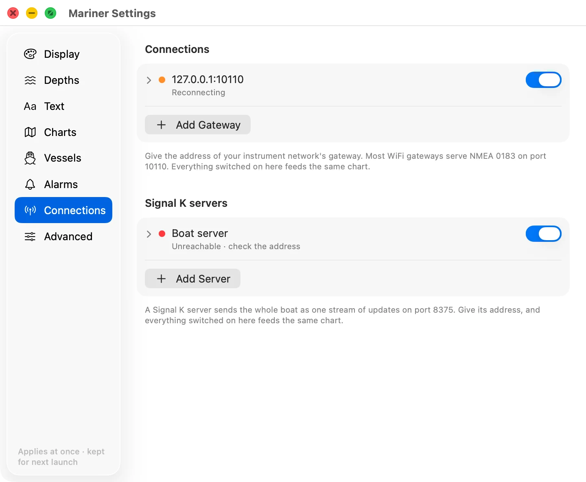

# Signal K servers

Signal K is an open standard for boat data: a server on the boat reads every
instrument it can reach and streams the values in one format.

A Signal K server is a second way in, beside a
[NMEA gateway](instrument-connections.md). A boat can have both, and Lookout
reads both at once.

## Adding a server

Open the gear (⌘, or Ctrl+,), choose **Connections**, then **Add Server**.
Servers keep their own list under **Signal K servers**, below the gateways.

- **Name.** What you call this server. Leave it empty and the row shows the
  address instead.
- **Address.** The server's name or IP address on the boat's network.
- **Port.** Most servers stream on port 8375.
- **WebSocket.** It starts off, which reads the plain stream. On reads the
  WebSocket stream instead, which the reference server serves on port 3000.
- **On.** The switch at the right of the row.

Port 3000 is the server's own web page. If you type the address into a browser
and the server's dashboard comes up, that is port 3000, and it is not the plain
stream. Use 8375 with **WebSocket** off, or 3000 with **WebSocket** on.

A row reports its state the same way a gateway's does: **Connected** with a
rate, **Reconnecting**, **Unreachable**, **Paused** or **No address**. The rate
counts deltas a second. A delta is one update from the server, which may carry
several values.

## How a Signal K server differs from a gateway

A gateway repeats one instrument network, sentence by sentence, and whatever is
not on that network is not in the stream. A server collects from everything it
can reach, NMEA 0183 and NMEA 2000 and anything else it has a driver for, and
sends the boat as one named set of values.

What Lookout takes out of that stream is the same short list either way: your
position, heading, course and speed, the depth, the wind, and the AIS traffic. A
server carrying tank levels, engine temperatures and battery state is sending
them, and Lookout does not read them yet.

## Working out why nothing draws

**The row says Unreachable.** The address is wrong, the server is not running,
or you have the plain stream's port with **WebSocket** on, or the web page's
port with it off.

**The row says Connected · N deltas/s, own ship not named.** The stream is
arriving, and it never said which vessel is yours. Your boat will not draw,
though the AIS traffic around it will. Fix it in the server: it is the server's
own vessel identity that is missing, not anything you type here.

**The row says Connected and nothing draws at all.** The server has reached no
instruments. Its own dashboard, on port 3000, lists what it is receiving.
