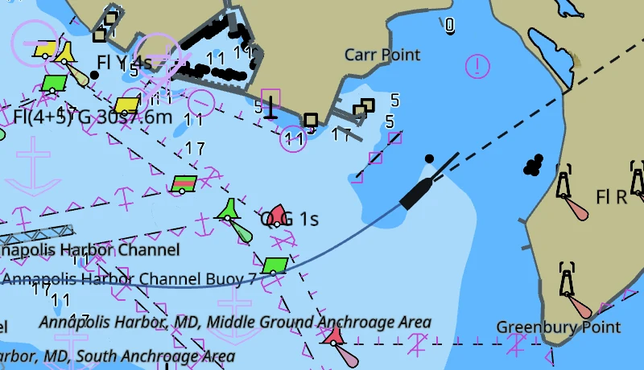

# Your boat on the chart

Your boat draws as soon as a [connection](instrument-connections.md) carries a
position. Nothing else has to be set up.

## Reading the boat, the heading line and the course line

The boat is a hull outline, turned to the direction the bow is pointing. There
is nowhere to enter your own boat's length yet, so it is drawn as a twelve metre
hull. It never draws smaller than about 9 mm on the screen, however far you zoom
out.

Two lines run out of it.

- **The heading line** is short and always the same length. It is where the bow
  points, from the compass.
- **The course line** is the longer one, with a small circle on its end. It is
  the track you are making over the ground, from the GPS, and it reaches as far
  as you travel in six minutes. It shrinks as you slow down, so it is a stub on
  the hull at a mooring.

Six minutes is where it starts. Change it under **Vessels** in the settings.

In still water the two lie on top of each other. In a tide they do not. The bow
points one way and the boat travels another, and the angle between the lines is
the set you are carrying. The ringed line is the one to lay on the course you
want to make good.

With no compass on the boat the hull is turned to the course over ground
instead, and the heading line follows the course as well. Both lines then say
the same thing, and the tide is not visible in them.

## Reading the port and starboard laylines

If the instruments report a true wind direction, four more dashed lines run out
of the boat, each a nautical mile long: red for the port tack, green for the
starboard tack. Two of them are the close-hauled course on each tack, up
towards the wind. The other two are the course on each gybe, running away from
it. They come off the chart as soon as the wind value stops.

The angles are yours to set, under **Display** in the settings. They start at 45
degrees off the true wind upwind and 170 downwind. Both are measured off the
wind the same way, so 170 puts the downwind pair ten degrees either side of dead
before it, and 180 puts the two on top of each other. Take the numbers off your
boat's polar, or off the angles you find yourself sailing.

## Reading the track astern

The blue line behind the boat is where you have been. It keeps the last six
hundred positions, and it takes a new one only when the boat has moved a couple
of metres, so a boat swinging at anchor does not fill it.

The track is not saved. It starts empty every time the app starts, and it
starts again from the new position if the fix jumps somewhere the boat could
not have sailed.

## Holding the boat on the screen

The compass bubble in the top right corner is also the lock. Click or tap it and
the chart locks to your boat. The boat then holds one point on the screen, the
middle across and three quarters of the way down, and the chart slides under it.
It sits low in the view so that most of the screen is the water ahead of you.

The bubble fills in while the lock holds. Drag the chart and the lock drops and
the bubble empties. Zoom instead and the lock holds, and the zoom goes in on the
boat wherever the pointer is.

Lock the chart before a fix has arrived and the bubble draws a ring and waits.
The chart stays where it is until there is a position to follow.

## Turning the chart course up

Tap the bubble again once the chart is locked. The chart turns so your course
is up the screen and keeps turning as you turn, and the letter in the bubble
changes from **N** to **C**. Tap once more for north up, still locked.

Under **C** the mark in the bubble stands still and points up the screen, which
is your course. Under **N** it turns with the chart and points at north.

Turning the chart by hand, or pressing ⌘↑ (Ctrl+↑), puts it back to north up.
The lock is not affected.

## Losing the position and getting it back

If no position arrives for five seconds, the boat comes off the chart, and the
heading line, the course line and the track go with it. Nothing is left behind
at the last known position. The chart itself does not change.

The compass bubble goes back to its waiting ring if the chart was locked. When
the fix returns the boat draws again, the track picks up where it left off, and
the lock takes hold on its own.

A gap of a few seconds is normal in a marina or under a bridge. A gap that does
not end is the GPS itself, or the connection carrying it. The
[instrument connections](instrument-connections.md) page has what to check.
