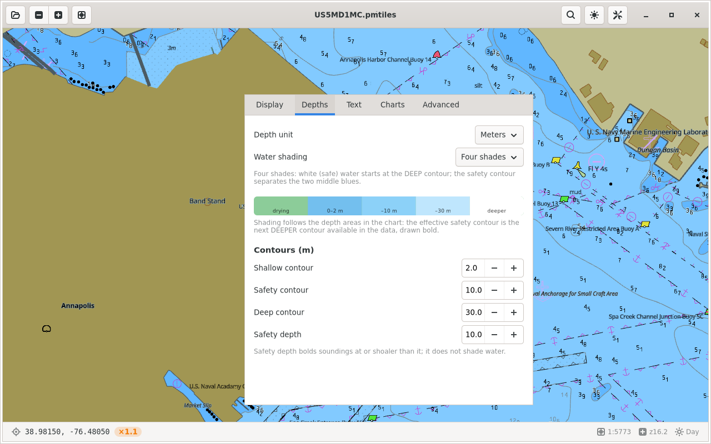

# Lookout Marine — the app (Linux / GTK4)

A native **GTK4** S-52 chartplotter around the Zig chart core, which renders
**raw Vulkan** (`src/gpu_vk.zig`) straight into a native child surface under the
GTK window. The Linux counterpart of the SwiftUI shell on macOS/iOS and the Java
shell on Android: same core, same C ABI, same behaviour — a platform-native
shell around one GPU-rendered chart surface.


The headerbar carries open/recents, zoom, fit and north-up on the left, and
search, display and settings on the right. The status bar carries the cursor (or
centre) coordinate, an amber overscale badge when the view is finer than the
data supports, then scale, zoom and scheme.

The full S-52 mariner panel is a separate window (**Ctrl+,**), tabbed the same
way as the macOS form. Edits auto-apply, debounced, and persist:



## Prerequisites

- **GTK 4.10+**, **Vulkan** headers and a loader, and X11 and/or Wayland client
  libraries.
- **Zig 0.16** on `PATH`.
- **meson** + **ninja**.

```sh
sudo apt install libgtk-4-dev libvulkan-dev libx11-dev libwayland-dev \
                 meson ninja-build          # Debian/Ubuntu
```

tile57 is **not** a prerequisite: it is a Zig package dependency of the core. A
sibling `../../tile57` checkout is used when present; otherwise the commit
pinned in `../build.zig.zon` is fetched on first build.

## Build & run

```sh
cd linux
meson setup build
ninja -C build
./build/lookout-marine
```

One step: `meson` drives `build-core.sh`, which runs
`zig build lib -Dbackend=vk` to build the tile57 engine and the lookout core,
and drops `liblookout_marine.a`, `libtile57.a`, `lookout.h` and `tile57.h` into
the build directory. The core is `ReleaseFast` in every configuration
(`-Dcore-optimize=Debug` to develop on it) — the app chases 60 fps and a Debug
core visibly drops frames.

You need a baked `.pmtiles` chart to see anything. **Open** in the headerbar
picks a file or a folder of cells; on first launch the app also probes
`$LOOKOUT_OPEN` (a chart, or a folder — handy for dev runs), then the last
recent, then `~/.cache/chartplotter/NOAA/tiles/d5/US5MD1MC.pmtiles`.
`$LOOKOUT_VIEW="lon,lat,zoom[,rot]"` pins the opening camera, and
`$LOOKOUT_NO_DMABUF=1` forces the native-surface fallback — the only way to
exercise that path on a machine where the texture path works.

## What's in here

| File | Role |
|------|------|
| `src/main.c` | `GtkApplication` entry, CSS, accelerators |
| `src/lk-window.c` | The window: headerbar, chart, status bar, actions, open dialog |
| `src/lk-chart-view.c` | The chart widget: owns the native surface, all input |
| `src/lk-chart-controller.c` | The one `lookout*` handle; every `lookout_*` call; the render loop |
| `src/lk-chart-texture.c` | Imports lookout's exported dmabuf frame as a `GdkTexture` |
| `src/lk-native-surface.c` | Fallback: the X11 child window / Wayland subsurface the chart presents into |
| `src/lk-app-model.c` | Shared state, recents, open paths, coordinate parser |
| `src/lk-hud.c` | Status-bar readouts, identify panel, DMS formatting |
| `src/lk-search.c` | Coordinate go-to (feature search stubbed) |
| `src/lk-mariner.c` | The live `tile57_mariner` behind the settings form |
| `src/lk-settings-window.c` | The S-52 mariner form (Display / Depths / Text / Charts / Advanced) |
| `src/lk-store.c` | Camera pose, recents and settings in one XDG keyfile |
| `build-core.sh` | Builds the Zig core where meson expects its outputs |

## How the chart gets on screen

Two paths. The shell picks at open and falls back automatically.

**Texture (preferred).** lookout renders into an image it exports as a **dmabuf**
(`VK_EXT_image_drm_format_modifier` + `VK_KHR_external_memory_fd`), and the
shell imports the fd through `GdkDmabufTextureBuilder`. The chart becomes an
ordinary node in GTK's scene graph, so **every widget composites over it** and
the chrome floats exactly as it does on macOS and iPad — HUD bar, zoom bubbles,
compass, identify popover. The pixels never leave the GPU. Frames rotate through
a three-image ring so GTK is never reading the image the next render is writing.

**Native surface (fallback).** When the driver cannot export or GTK advertises
no import formats, the chart gets its own child surface under the toplevel — an
X11 child window or a Wayland subsurface, as `../include/lookout.h` describes.
That surface composites *above* the widget tree, so nothing can be drawn on it:
the HUD becomes a status bar below the chart and the zoom controls live in the
headerbar. Everything is still reachable, just beside the chart rather than on
it. `lk_chart_view_can_overlay()` is what the window asks to choose the layout.

Either way the chart is **vector all the way to the rasterizer**. tile57
tessellates the S-57 geometry once, and each frame is a uniform update with the
camera, palette and SCAMIN gates evaluated in the vertex shader. Nothing is
pre-rendered or cached as a bitmap. The texture is allocated at exactly widget
size x scale factor and drawn 1:1 with `GSK_SCALING_FILTER_NEAREST`, so the
frame is never resampled — get that sizing wrong and the chart goes soft, which
is the one failure mode this path has that direct presentation does not.

Input on the fallback path needs the surface to be **input-transparent**: on X11
the child window selects no events (X propagates them to the GTK toplevel), and
on Wayland the subsurface carries an empty input region (the compositor passes
them to the parent). The texture path needs none of this — it is an ordinary
widget.

GTK 4.18 deprecated the X11 backend API wholesale without replacing it, so the
fallback builds with two deprecation warnings (`gdk_x11_display_get_xdisplay`,
`gdk_x11_surface_get_xid` — the only way to name a `GdkSurface`'s X window).
They are left visible on purpose. The texture path avoids them entirely, which
is a second reason to prefer it.

## Rendering

The core renders via Vulkan directly, creating the instance, device and four
pipelines (chart / sprite / SDF / pattern) from precompiled SPIR-V. On the
texture path it opens with `LOOKOUT_NATIVE_NONE` and the frame comes back from
`lookout_render_dmabuf`; on the fallback it takes `LOOKOUT_NATIVE_X11_WINDOW` or
`LOOKOUT_NATIVE_WAYLAND_SURFACE` and presents into a swapchain. The core is a
static library that leaves the loader to its host, so this executable links
`libvulkan`.

The render loop is on-demand, mirroring the macOS display link: a GTK frame-clock
tick that runs only while something is animating or the scene is dirty, and
removes itself once the chart is static, so an idle chart costs no CPU.
Everything runs on the main thread — the engine's contract wants one thread and
GTK wants the main one.

## Testing

- **Core unit tests:** `zig build test -Dbackend=vk` from the repo root.
- **Render parity / smoke:** `zig-out/bin/lookout-marine-demo <chart.pmtiles>`.
- **Headless run:** both backends run against Mesa's **lavapipe** software
  Vulkan, which is how the shell is verified without a GPU.
  ```sh
  # X11
  Xvfb :99 -screen 0 1400x900x24 &
  DISPLAY=:99 GDK_BACKEND=x11 LOOKOUT_OPEN=chart.pmtiles ./build/lookout-marine

  # Wayland (--debug also enables weston-screenshooter)
  weston --backend=headless --renderer=pixman --width=1400 --height=900 \
         --socket=lk-wl --debug &
  WAYLAND_DISPLAY=lk-wl GDK_BACKEND=wayland LOOKOUT_OPEN=chart.pmtiles \
    ./build/lookout-marine
  ```
  `XDG_RUNTIME_DIR` has to be short: a Wayland socket path is capped at 108
  bytes, and a deep scratch directory blows it.

## Verified, and not

Everything was run headlessly against Mesa's **lavapipe** software Vulkan — X11
under Xvfb, Wayland under `weston --backend=headless --renderer=pixman`.

**Texture path:** the export ring is created at the widget's exact pixel size
and the frame arrives intact — a standalone spike read a GPU-cleared image back
through `GdkDmabufTexture` byte-exact (S-52 NODATA 147,174,187 in, the same
out). A flat land sample renders to the identical palette value through both
paths, so nothing is transformed on the way. The chrome floats over the chart as
it does on macOS.

**Fallback path:** the native surface comes up on both backends and the
swapchain matches the widget allocation, including on Wayland, where the CSD
shadow makes the surface transform non-zero and a wrong one would visibly offset
the chart.

**Input** (X11, the backend that takes synthetic events): readouts track, hover
switches the readout to the cursor coordinate, drag-to-pan reaches the engine,
and the settings window opens and renders every tab.

**Not exercised:** input on Wayland (nothing here can inject events into
weston); HiDPI (`scale_factor > 1`) on either path; the resize transient on the
texture path — a frame where the ring and the widget disagree would show as hard
aliasing rather than blur, which is why the draw uses `NEAREST`, but it has not
been provoked; identify; and the fling and rotate gestures.

## Deferred

- **Feature / place-name search.** Coordinate go-to works; name search is
  stubbed and labelled "coming soon". It needs a name index in tile57 and a
  matching `lookout_*` query. We do not fake results.
- **Desktop entry / icon / packaging.** The app installs a bare executable.

## Core changes this shell required

Added to `../include/lookout.h`, `../src/capi.zig`, `../src/gpu_vk.zig` and
`../build.zig`:

- `nativeKind()` now maps the desktop kinds (win32 / x11 / wayland). The header
  documented them and `gpu_vk.zig` implemented them, but the ABI rejected them,
  so `lookout_open_in_window` could not be called with an X11 or Wayland handle.
- `lookout_set_cache_dir` and `lookout_set_pixel_density` are now **declared** in
  `lookout.h`; both were already exported.
- **Swapchain extent on Wayland.** `createSwapchain` fell back to its own
  previous size when the surface reports an undefined `currentExtent` (the normal
  Wayland case), which pinned the swapchain to whatever it was first created at
  and left every later resize recreating the same extent. It now derives the
  extent from the host's declared points × density, as `extentStale()` already did.
- **`stderr` on the desktop Vulkan path.** `@extern(*anyopaque, "stderr")` yields
  the *address of* glibc's `stderr` variable, not the `FILE*` it holds, so every
  log call passed `&stderr` to `fprintf` and the first one segfaulted. Android
  never hit it (logcat), and Metal/SDL don't use that file.
- **Nested archive members.** `liblookout_marine.a` embedded `libtile57.a` as a
  nested `.a` member, which ld64 unpacks but every ELF and COFF linker rejects.
  It is now embedded only on Apple targets; elsewhere the host links the pair
  from `<prefix>/lib`, which is what the install step already provides.
- **Swapchain colour format.** The format search only accepted
  `R8G8B8A8_UNORM` and otherwise took the surface's first format, which on this
  driver is `B8G8R8A8_SRGB`. The palette hands the shader colours that are
  already sRGB, so an `_SRGB` swapchain encodes them a second time and the whole
  chart renders pale — S-52 NODATA measured 200,215,222 against its true
  147,174,187. It now takes either UNORM ordering, then any non-`_SRGB` format,
  and logs an error if a surface offers nothing but sRGB.

[tile57]: https://github.com/beetlebugorg/tile57
