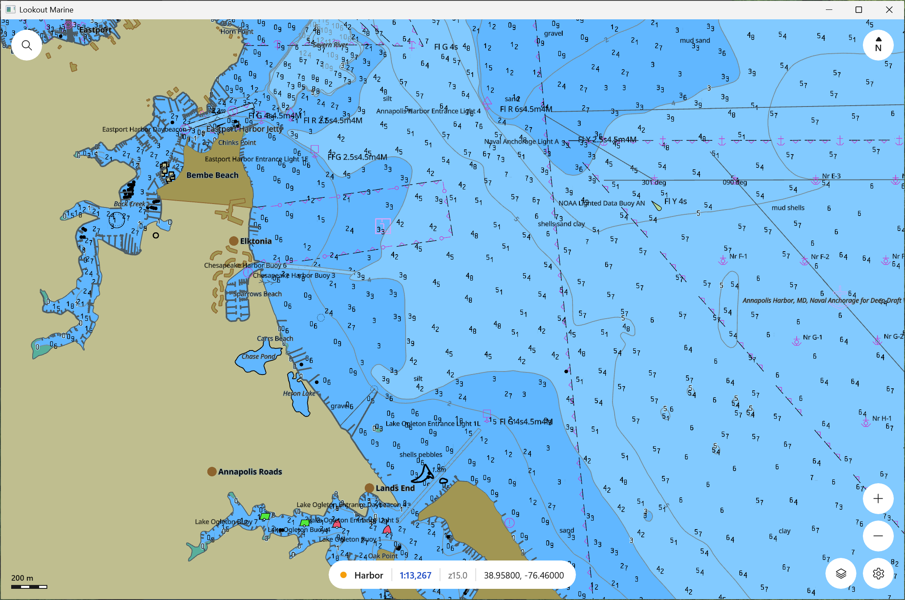

# Lookout Marine — the app (Windows / WinUI 3)

A native **WinUI 3** (Windows App SDK, C++/WinRT) chartplotter around the Zig
chart core. The Windows counterpart of the SwiftUI shell on macOS/iOS, the GTK4
shell on Linux, and the Java shell on Android: same core, same C ABI, same
behaviour.



The core renders with **Direct3D 12**, the Windows form of the macOS Metal
transport. The core owns the device, the pipelines (HLSL, compiled at
runtime), and a composition swapchain. The shell attaches that swapchain to a
`SwapChainPanel` (`ISwapChainPanelNative::SetSwapChain`) and the XAML chrome
floats over the chart. On a machine with no GPU driver the core selects
**WARP**, the in-box software rasterizer, so the app runs everywhere.

## Prerequisites

- **Windows 11**, **Visual Studio 2022+** with the C++ workload, **Windows SDK
  10.0.22621+**.
- **Zig 0.16** on `PATH`.
- NuGet restores `Microsoft.WindowsAppSDK` and `Microsoft.Windows.CppWinRT`
  on the first build.

tile57 is **not** a prerequisite: it is a Zig package dependency of the core.

## Build & run

```powershell
pwsh windows/build-core.ps1     # zig build lib -Dbackend=d3d12 -> ../zig-out
cd windows
msbuild LookoutMarine.vcxproj -t:Restore /p:Configuration=Release /p:Platform=ARM64
msbuild LookoutMarine.vcxproj /p:Configuration=Release /p:Platform=ARM64
.\ARM64\Release\LookoutMarine.exe
```

Use `/p:Platform=x64` on an x64 machine. The app is unpackaged and
self-contained: the build copies the Windows App SDK runtime next to the exe.

You need a baked `.pmtiles` chart to see anything. **Open** (top-left bubble)
takes one chart or a folder of cells. On first launch the app probes
`$LOOKOUT_OPEN`, then the last recent, then the repo's bundled test cell.

Environment variables: `LOOKOUT_OPEN=<chart|dir>` opens at startup.
`LOOKOUT_WARP=1` forces the software rasterizer. `LOOKOUT_OPEN_SETTINGS=1`
opens the mariner pane at startup (screenshots).

## What's in here

| File | Role |
|------|------|
| `ui/MainWindow.xaml.cpp` | Window construction, chrome wiring, the render thread |
| `ui/MainWindow.Open.cpp` | Open flow, layers flyout, pickers, the chart panel |
| `ui/MainWindow.Input.cpp` | Gestures, commands, pick, coordinate search |
| `ui/MainWindow.Hud.cpp` | Readout capsule and the scale bar |
| `ui/MainWindow.Settings.cpp` | The mariner pane: tabbed pages, debounced apply |
| `ui/winrt_glue.cpp` | Compiles the XAML-generated TUs a command-line build does not auto-register |
| `src/lk_controller.*` | The one `lookout*` handle; every `lookout_*` call; render-loop helpers |
| `src/lk_store.*` | Camera pose, recents and mariner settings in `%APPDATA%\lookout-marine\settings.ini` |
| `src/lk_coord.*` | Coordinate go-to parser and DMS formatting |
| `src/lk_paths.*`, `src/lk_format.*`, `src/lk_backdrop.*` | Chart discovery, HUD formatting, the transparent backdrop |
| `build-core.ps1` | Builds the Zig core where the vcxproj expects its outputs |

Notes:

- The core renders on a dedicated thread. WARP frames can take tens of ms; on
  the UI thread they starve XAML's own rendering.
- The panel's visual carries the XAML composition scale. The swapchain is in
  device pixels, so the shell sets the inverse scale on the swapchain
  (`IDXGISwapChain2::SetMatrixTransform`) after attach and on a DPI change.
